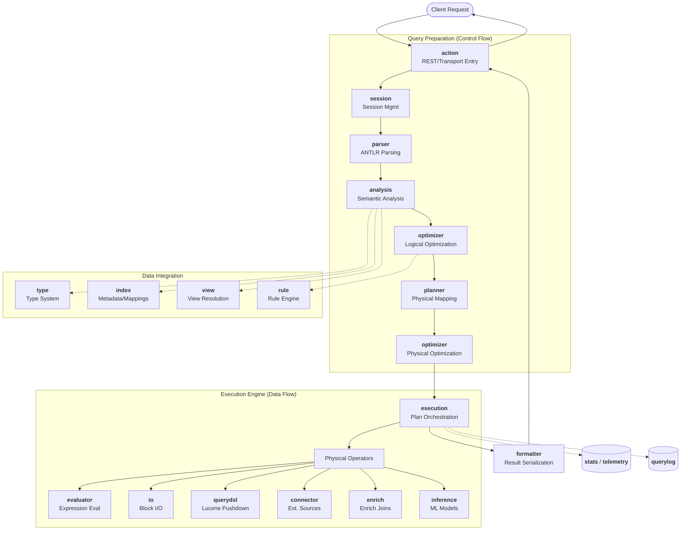

# ESQL Codebase Summary

The ESQL engine in Elasticsearch follows a structured query processing lifecycle, from parsing raw strings to executing distributed physical operators.

## ESQL Package Summaries

*   **`action`**: Handles incoming REST and Transport requests for ESQL, orchestrating the initial response lifecycle and result delivery.
*   **`analysis`**: Performs semantic validation, type resolution, and binding of the logical plan against index metadata and internal catalogs.
*   **`approximation`**: Implements logic and settings for approximate query execution, enabling faster results with potential accuracy trade-offs.
*   **`capabilities`**: Provides interfaces and markers that components use to signal support for specific plan stages, optimizations, or features.
*   **`common`**: Contains shared utility classes, base exception types, and constants used throughout the ESQL plugin.
*   **`connector`**: Provides an extensible framework and specific implementations for querying external data sources or specialized internal engines.
*   **`core`**: Defines fundamental building blocks like tree nodes, expression base classes, and internal representations used across multiple packages.
*   **`enrich`**: Integrates with Elasticsearch's enrich processor, allowing queries to join streaming results with pre-built enrich indices.
*   **`evaluator`**: Contains the runtime logic for evaluating expressions and functions against data blocks during query execution.
*   **`execution`**: Orchestrates the runtime execution of physical plans, managing the flow of data across operators and potentially different nodes.
*   **`expression`**: Defines the AST nodes for ESQL expressions, including functions, operators, literals, and column references.
*   **`formatter`**: Handles the conversion of internal result blocks into various output formats such as CSV, JSON, and text.
*   **`index`**: Interfaces with Elasticsearch index services to resolve field mappings, handle shards, and retrieve index-level metadata.
*   **`inference`**: Implements the `INFERENCE` command, enabling machine learning model invocation directly within ESQL query pipelines.
*   **`io`**: Manages high-performance data streams and block-based I/O, including serialization logic for inter-node communication.
*   **`optimizer`**: Applies transformation rules to logical and physical plans to improve query performance and reduce resource usage.
*   **`parser`**: Translates ESQL and PromQL query strings into an initial `LogicalPlan` using generated ANTLR parsers.
*   **`plan`**: Defines the core data structures for logical and physical query plans that represent the query's lifecycle.
*   **`planner`**: Translates optimized logical plans into executable physical operation trees through a mapping process.
*   **`plugin`**: Implements the standard Elasticsearch plugin boilerplate, lifecycle hooks, and service wiring for the ESQL engine.
*   **`querydsl`**: Facilitates the conversion between ESQL operations and standard Elasticsearch Query DSL for efficient pushdown to Lucene.
*   **`querylog`**: Implements a specialized logger for ESQL queries to monitor performance, resource usage, and audit query execution.
*   **`rule`**: Provides the engine for defining and executing transformation rules used by the optimizer and analyzer.
*   **`score`**: Manages relevance scoring integration, allowing ESQL to leverage Elasticsearch's native BM25 and other scoring algorithms.
*   **`session`**: Tracks the state, lifecycle, and resource allocation for individual query executions within the ESQL engine.
*   **`stats`**: Collects and manages performance metrics and usage statistics across various ESQL internal components.
*   **`telemetry`**: Provides diagnostic tools and monitoring data collection for analyzing the health and performance of ESQL.
*   **`type`**: Defines the ESQL type system, handling data type definitions, compatibility rules, and conversion logic.
*   **`view`**: Implements virtual tables (views), allowing complex ESQL queries to be saved and referenced as named relations.

## Architectural Interaction Diagram

The following diagram illustrates the control and data flow through the ESQL engine components:

