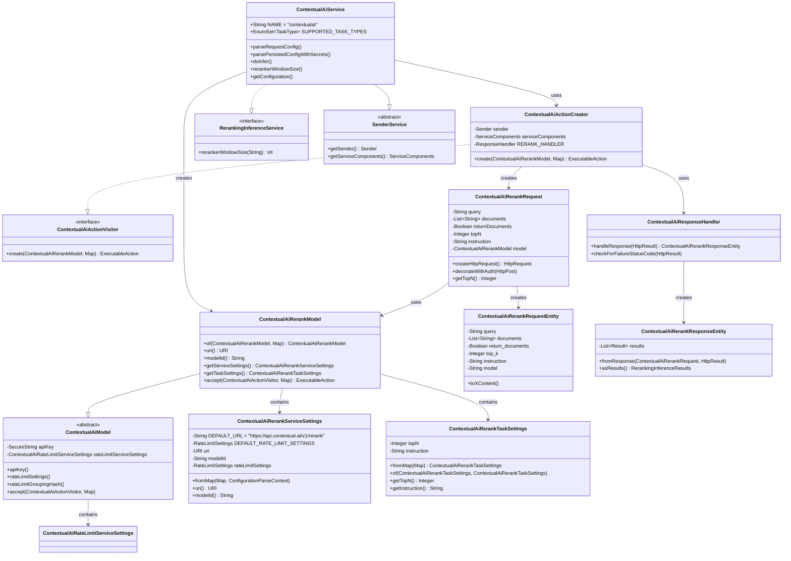
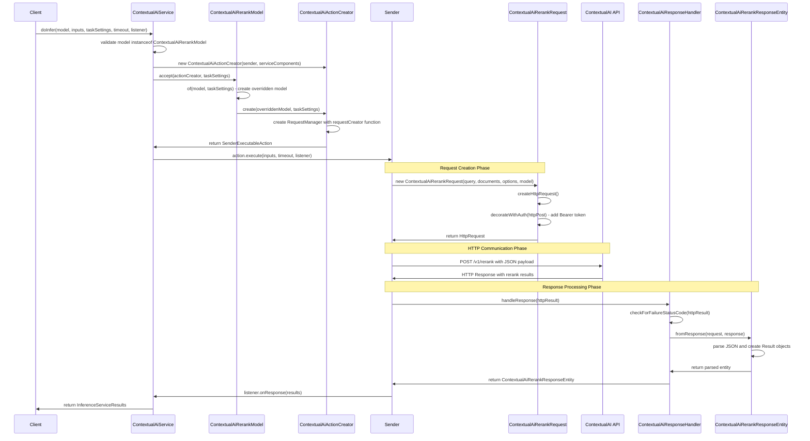

# ContextualAI Integration Architecture

This document provides an overview of the ContextualAI integration in Elasticsearch, including class relationships, sequence flows, and architectural patterns.

## Overview

The ContextualAI integration enables Elasticsearch to use ContextualAI's API for document reranking tasks. The implementation follows Elasticsearch's inference service pattern and integrates with the HTTP client framework for external API communication.

## Class Diagram



## Component Architecture

### Service Layer
- **ContextualAiService**: Main entry point implementing Elasticsearch's inference service interface
- **SenderService**: Base class providing HTTP request sending capabilities
- **RerankingInferenceService**: Interface defining reranking-specific operations

### Model Layer
- **ContextualAiModel**: Abstract base model containing common functionality (API key, rate limiting)
- **ContextualAiRerankModel**: Concrete implementation for reranking tasks
- **Settings Classes**: Configuration holders for service and task-specific settings

### Action Layer
- **ContextualAiActionCreator**: Factory for creating executable actions using visitor pattern
- **ContextualAiActionVisitor**: Visitor interface for action creation

### Request/Response Layer
- **ContextualAiRerankRequest**: HTTP request builder
- **ContextualAiRerankRequestEntity**: JSON request body structure
- **ContextualAiRerankResponseEntity**: Response parser and result converter
- **ContextualAiResponseHandler**: Response processing and error handling

## Sequence Diagram



## Key Design Patterns

### 1. Visitor Pattern
The action creation uses the visitor pattern to allow different model types to create their appropriate actions:

```java
// ContextualAiActionVisitor interface
public interface ContextualAiActionVisitor {
    ExecutableAction create(ContextualAiRerankModel model, Map<String, Object> taskSettings);
}

// Model accepts visitor
public ExecutableAction accept(ContextualAiActionVisitor visitor, Map<String, Object> taskSettings) {
    return visitor.create(this, taskSettings);
}
```

### 2. Builder Pattern
Settings are constructed using factory methods that parse configuration maps:

```java
public static ContextualAiRerankServiceSettings fromMap(Map<String, Object> map, ConfigurationParseContext context) {
    // Parse and validate configuration
    // Return constructed settings object
}
```

### 3. Factory Pattern
The service creates models through factory methods that handle different parsing contexts:

```java
private static ContextualAiRerankModel createModel(
    String inferenceEntityId,
    TaskType taskType,
    Map<String, Object> serviceSettings,
    Map<String, Object> taskSettings,
    @Nullable Map<String, Object> secretSettings,
    String failureMessage,
    ConfigurationParseContext context
) {
    // Validate task type and create appropriate model
}
```

## Configuration Flow

### Request Configuration (Runtime)
1. Client provides configuration map
2. Service extracts service_settings, task_settings, and secret_settings
3. Settings objects are created using `fromMap()` methods
4. Model is constructed with parsed settings
5. Validation occurs at each step with detailed error messages

### Persistent Configuration (Stored)
1. Configuration is loaded from cluster state
2. Secrets are retrieved separately from secure storage
3. Model is reconstructed with both configuration and secrets
4. Rate limiting and API key validation occur during reconstruction

## Rate Limiting Integration

The integration includes sophisticated rate limiting:

- **Per-API-Key Grouping**: Requests are grouped by API key hash for rate limiting
- **Configurable Limits**: Default 1000 requests per minute, configurable via settings
- **Elasticsearch Integration**: Uses Elasticsearch's built-in rate limiting framework

## Error Handling

### HTTP Error Responses
- **ContextualAiResponseHandler**: Processes HTTP status codes and error responses
- **Retry Logic**: Integrates with Elasticsearch's retry framework
- **Error Entity Parsing**: Structured error response parsing for API errors

### Validation Errors
- **Configuration Validation**: Comprehensive validation during model creation
- **Runtime Validation**: Input validation before API requests
- **Detailed Messages**: Context-specific error messages for debugging

## API Integration Details

### Request Format
```json
{
    "query": "search query",
    "documents": ["doc1", "doc2", "doc3"],
    "return_documents": true,
    "top_k": 10,
    "instruction": "optional instruction",
    "model": "model-id"
}
```

### Response Format
```json
{
    "results": [
        {
            "index": 0,
            "relevance_score": 0.95,
            "document": "doc content"
        }
    ]
}
```

### Authentication
- Uses Bearer token authentication
- API key stored securely in Elasticsearch's secure settings
- Automatic header injection in HTTP requests

## Extension Points

### Adding New Task Types
1. Extend `ContextualAiModel` with new model class
2. Create corresponding settings classes
3. Add task type to `SUPPORTED_TASK_TYPES`
4. Implement visitor method in `ContextualAiActionCreator`

### Custom Endpoints
- URL configuration is supported through service settings
- Default: `https://api.contextual.ai/v1/rerank`
- Can be overridden per model configuration

### Response Processing
- Extend `ContextualAiResponseHandler` for custom response processing
- Override `fromResponse()` methods in response entities
- Add custom result conversion logic

## Testing Considerations

### Unit Tests
- Mock HTTP responses for request/response testing
- Settings validation testing
- Model creation and configuration parsing

### Integration Tests
- End-to-end API communication tests
- Rate limiting behavior verification
- Error handling and retry logic testing

## Using ContextualAI Reranking in Elasticsearch Queries

The ContextualAI integration is designed to enhance search relevance by reranking search results using ContextualAI's API. Here's how to use it in practice:

### 1. Model Configuration

First, create an inference endpoint with the ContextualAI service:

```json
PUT _inference/rerank/my-contextual-rerank-model
{
  "service": "contextualai",
  "service_settings": {
    "api_key": "your-contextual-ai-api-key",
    "model_id": "contextual-ai-model-name",
    "url": "https://api.contextual.ai/v1/rerank"
  },
  "task_settings": {
    "top_n": 10,
    "instruction": "Rerank these documents based on relevance to the query"
  }
}
```

### 2. Search with Reranking

Use the rerank retriever in your search queries to rerank initial search results:

```json
GET /my-index/_search
{
  "retriever": {
    "rerank": {
      "retriever": {
        "standard": {
          "query": {
            "multi_match": {
              "query": "machine learning applications",
              "fields": ["title^2", "content", "tags"]
            }
          }
        }
      },
      "field": "content",
      "inference_id": "my-contextual-rerank-model",
      "inference_text": "machine learning applications",
      "rank_window_size": 100,
      "min_score": 0.5
    }
  },
  "size": 10
}
```

### 3. Query Parameters Explained

- **`retriever.rerank.retriever`**: The initial retrieval strategy (BM25, vector search, etc.)
- **`field`**: The document field containing text to be reranked
- **`inference_id`**: The name of your ContextualAI rerank model
- **`inference_text`**: The query text used for reranking (can differ from initial query)
- **`rank_window_size`**: Number of initial results to send for reranking (default: 100)
- **`min_score`**: Minimum relevance score threshold for returned results

### 4. Hybrid Search with Reranking

Combine multiple retrieval strategies with ContextualAI reranking:

```json
GET /my-index/_search
{
  "retriever": {
    "rerank": {
      "retriever": {
        "rrf": {
          "retrievers": [
            {
              "standard": {
                "query": {
                  "match": {
                    "content": "machine learning applications"
                  }
                }
              }
            },
            {
              "knn": {
                "field": "content_embedding",
                "query_vector": [0.1, 0.2, 0.3, ...],
                "k": 50,
                "num_candidates": 100
              }
            }
          ],
          "rank_window_size": 100
        }
      },
      "field": "content",
      "inference_id": "my-contextual-rerank-model",
      "inference_text": "machine learning applications in healthcare",
      "rank_window_size": 50
    }
  },
  "size": 10
}
```

### 5. Advanced Usage Patterns

#### Dynamic Reranking Instructions
Customize reranking behavior per query:

```json
GET /my-index/_search
{
  "retriever": {
    "rerank": {
      "retriever": { /* your base retriever */ },
      "field": "content",
      "inference_id": "my-contextual-rerank-model",
      "inference_text": "find technical documentation",
      "model_text": "Prioritize technical accuracy and implementation details"
    }
  }
}
```

#### Multi-field Reranking
Rerank based on multiple document fields:

```json
GET /my-index/_search
{
  "retriever": {
    "rerank": {
      "retriever": { /* your base retriever */ },
      "field": "combined_content", 
      "inference_id": "my-contextual-rerank-model",
      "inference_text": "customer support best practices"
    }
  },
  "_source": {
    "includes": ["title", "content", "category", "score"]
  },
  "script_fields": {
    "combined_content": {
      "script": {
        "source": "params._source.title + ' ' + params._source.content + ' ' + params._source.category"
      }
    }
  }
}
```

### 6. Performance Considerations

#### Optimal Rank Window Size
- **Small collections (<10K docs)**: Use rank_window_size of 50-100
- **Large collections (>100K docs)**: Use rank_window_size of 100-500
- **Balance**: Larger windows improve relevance but increase latency and cost

#### Caching Strategy
```json
GET /my-index/_search
{
  "retriever": {
    "rerank": {
      /* rerank configuration */
    }
  },
  "request_cache": true,
  "preference": "_local"
}
```

### 7. Monitoring and Debugging

#### Check Inference Endpoint Status
```bash
GET _inference/rerank/my-contextual-rerank-model/_stats
```

#### View Reranking Details
Enable detailed logging to see reranking scores:

```json
GET /my-index/_search
{
  "retriever": { /* your rerank retriever */ },
  "explain": true,
  "ext": {
    "debug": {
      "rerank_details": true
    }
  }
}
```

### 8. Common Use Cases

#### E-commerce Product Search
```json
{
  "retriever": {
    "rerank": {
      "retriever": {
        "standard": {
          "query": {
            "bool": {
              "must": [
                { "match": { "product_name": "wireless headphones" } }
              ],
              "filter": [
                { "range": { "price": { "lte": 200 } } },
                { "term": { "in_stock": true } }
              ]
            }
          }
        }
      },
      "field": "product_description",
      "inference_id": "product-rerank-model",
      "inference_text": "best wireless headphones under $200",
      "rank_window_size": 50
    }
  }
}
```

#### Document Search with Context
```json
{
  "retriever": {
    "rerank": {
      "retriever": {
        "standard": {
          "query": {
            "multi_match": {
              "query": "API authentication methods",
              "fields": ["title^3", "content", "tags^2"]
            }
          }
        }
      },
      "field": "full_content",
      "inference_id": "documentation-rerank-model",
      "inference_text": "How to implement secure API authentication",
      "model_text": "Focus on security best practices and implementation examples",
      "rank_window_size": 75
    }
  }
}
```

### 9. Error Handling

Common error scenarios and solutions:

- **Rate Limiting**: Monitor `_stats` endpoint and implement request throttling
- **Model Unavailable**: Configure fallback to standard retrieval
- **Large Documents**: Consider document chunking strategies
- **Network Issues**: Implement retry logic and timeouts

### 10. Best Practices

1. **Start Small**: Begin with rank_window_size of 50-100 and adjust based on performance
2. **Monitor Costs**: Track API usage through ContextualAI dashboard
3. **A/B Testing**: Compare reranked vs. non-reranked results to measure improvement
4. **Field Selection**: Choose content-rich fields that best represent document relevance
5. **Query Optimization**: Ensure initial retriever returns relevant candidates for reranking

This integration enables sophisticated semantic reranking capabilities while maintaining Elasticsearch's performance and scalability characteristics.

---

This architecture provides a robust, extensible foundation for integrating ContextualAI's reranking capabilities into Elasticsearch's inference framework.