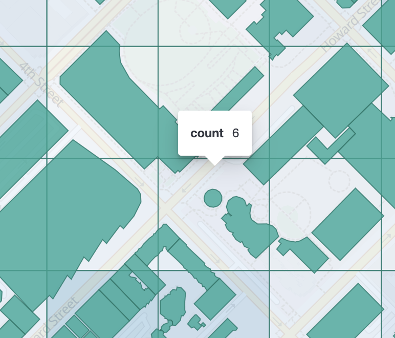

# Geohash grid aggregation [search-aggregations-bucket-geohashgrid-aggregation]


A multi-bucket aggregation that groups [`geo_point`](/reference/elasticsearch/mapping-reference/geo-point.md) and [`geo_shape`](/reference/elasticsearch/mapping-reference/geo-shape.md) values into buckets that represent a grid. The resulting grid can be sparse and only contains cells that have matching data. Each cell is labeled using a [geohash](https://en.wikipedia.org/wiki/Geohash) which is of user-definable precision.

* High precision geohashes have a long string length and represent cells that cover only a small area.
* Low precision geohashes have a short string length and represent cells that each cover a large area.

Geohashes used in this aggregation can have a choice of precision between 1 and 12.

::::{warning}
The highest-precision geohash of length 12 produces cells that cover less than a square metre of land and so high-precision requests can be very costly in terms of RAM and result sizes. Please see the example below on how to first filter the aggregation to a smaller geographic area before requesting high-levels of detail.
::::


You can only use `geohash_grid` to aggregate an explicitly mapped `geo_point` or `geo_shape` field. If the `geo_point` field contains an array, `geohash_grid` aggregates all the array values.

## Simple low-precision request [_simple_low_precision_request]

$$$geohashgrid-aggregation-low-precision-example$$$

```console
PUT /museums
{
  "mappings": {
    "properties": {
      "location": {
        "type": "geo_point"
      }
    }
  }
}

POST /museums/_bulk?refresh
{"index":{"_id":1}}
{"location": "POINT (4.912350 52.374081)", "name": "NEMO Science Museum"}
{"index":{"_id":2}}
{"location": "POINT (4.901618 52.369219)", "name": "Museum Het Rembrandthuis"}
{"index":{"_id":3}}
{"location": "POINT (4.914722 52.371667)", "name": "Nederlands Scheepvaartmuseum"}
{"index":{"_id":4}}
{"location": "POINT (4.405200 51.222900)", "name": "Letterenhuis"}
{"index":{"_id":5}}
{"location": "POINT (2.336389 48.861111)", "name": "Musée du Louvre"}
{"index":{"_id":6}}
{"location": "POINT (2.327000 48.860000)", "name": "Musée d'Orsay"}

POST /museums/_search?size=0
{
  "aggregations": {
    "large-grid": {
      "geohash_grid": {
        "field": "location",
        "precision": 3
      }
    }
  }
}
```

Response:

```console-result
{
  ...
  "aggregations": {
  "large-grid": {
    "buckets": [
      {
        "key": "u17",
        "doc_count": 3
      },
      {
        "key": "u09",
        "doc_count": 2
      },
      {
        "key": "u15",
        "doc_count": 1
      }
    ]
  }
}
}
```


## High-precision requests [_high_precision_requests]

When requesting detailed buckets (typically for displaying a "zoomed in" map) a filter like [geo_bounding_box](/reference/query-languages/query-dsl/query-dsl-geo-bounding-box-query.md) should be applied to narrow the subject area otherwise potentially millions of buckets will be created and returned.

$$$geohashgrid-aggregation-high-precision-example$$$

```console
POST /museums/_search?size=0
{
  "aggregations": {
    "zoomed-in": {
      "filter": {
        "geo_bounding_box": {
          "location": {
            "top_left": "POINT (4.9 52.4)",
            "bottom_right": "POINT (5.0 52.3)"
          }
        }
      },
      "aggregations": {
        "zoom1": {
          "geohash_grid": {
            "field": "location",
            "precision": 8
          }
        }
      }
    }
  }
}
```

The geohashes returned by the `geohash_grid` aggregation can be also used for zooming in. To zoom into the first geohash `u17` returned in the previous example, it should be specified as both `top_left` and `bottom_right` corner:

```console
POST /museums/_search?size=0
{
  "aggregations": {
    "zoomed-in": {
      "filter": {
        "geo_bounding_box": {
          "location": {
            "top_left": "u17",
            "bottom_right": "u17"
          }
        }
      },
      "aggregations": {
        "zoom1": {
          "geohash_grid": {
            "field": "location",
            "precision": 8
          }
        }
      }
    }
  }
}
```

```console-result
{
  ...
  "aggregations": {
    "zoomed-in": {
      "doc_count": 3,
      "zoom1": {
        "buckets": [
          {
            "key": "u173zy3j",
            "doc_count": 1
          },
          {
            "key": "u173zvfz",
            "doc_count": 1
          },
          {
            "key": "u173zt90",
            "doc_count": 1
          }
        ]
      }
    }
  }
}
```

For "zooming in" on the system that don’t support geohashes, the bucket keys should be translated into bounding boxes using one of available geohash libraries. For example, for javascript the [node-geohash](https://github.com/sunng87/node-geohash) library can be used:

```js
var geohash = require('ngeohash');

// bbox will contain [ 52.03125, 4.21875, 53.4375, 5.625 ]
//                   [   minlat,  minlon,  maxlat, maxlon]
var bbox = geohash.decode_bbox('u17');
```


## Requests with additional bounding box filtering [_requests_with_additional_bounding_box_filtering]

The `geohash_grid` aggregation supports an optional `bounds` parameter that restricts the cells considered to those that intersects the bounds provided. The `bounds` parameter accepts the bounding box in all the same [accepted formats](/reference/query-languages/query-dsl/query-dsl-geo-bounding-box-query.md#query-dsl-geo-bounding-box-query-accepted-formats) of the bounds specified in the Geo Bounding Box Query. This bounding box can be used with or without an additional `geo_bounding_box` query filtering the points prior to aggregating. It is an independent bounding box that can intersect with, be equal to, or be disjoint to any additional `geo_bounding_box` queries defined in the context of the aggregation.

$$$geohashgrid-aggregation-with-bounds$$$

```console
POST /museums/_search?size=0
{
  "aggregations": {
    "tiles-in-bounds": {
      "geohash_grid": {
        "field": "location",
        "precision": 8,
        "bounds": {
          "top_left": "POINT (4.21875 53.4375)",
          "bottom_right": "POINT (5.625 52.03125)"
        }
      }
    }
  }
}
```

```console-result
{
  ...
  "aggregations": {
    "tiles-in-bounds": {
      "buckets": [
        {
          "key": "u173zy3j",
          "doc_count": 1
        },
        {
          "key": "u173zvfz",
          "doc_count": 1
        },
        {
          "key": "u173zt90",
          "doc_count": 1
        }
      ]
    }
  }
}
```


## Cell dimensions at the equator [_cell_dimensions_at_the_equator]

The table below shows the metric dimensions for cells covered by various string lengths of geohash. Cell dimensions vary with latitude and so the table is for the worst-case scenario at the equator.

**GeoHash length**
:   **Area width x height**

1
:   5,009.4km x 4,992.6km

2
:   1,252.3km x 624.1km

3
:   156.5km x 156km

4
:   39.1km x 19.5km

5
:   4.9km x 4.9km

6
:   1.2km x 609.4m

7
:   152.9m x 152.4m

8
:   38.2m x 19m

9
:   4.8m x 4.8m

10
:   1.2m x 59.5cm

11
:   14.9cm x 14.9cm

12
:   3.7cm x 1.9cm


### Aggregating `geo_shape` fields [_aggregating_geo_shape_fields]

Aggregating on [Geoshape](/reference/elasticsearch/mapping-reference/geo-shape.md) fields works just as it does for points, except that a single shape can be counted for in multiple tiles. A shape will contribute to the count of matching values if any part of its shape intersects with that tile. Below is an image that demonstrates this:




## Options [_options_3]

field
:   Mandatory. Field containing indexed geo-point or geo-shape values. Must be explicitly mapped as a [`geo_point`](/reference/elasticsearch/mapping-reference/geo-point.md) or a [`geo_shape`](/reference/elasticsearch/mapping-reference/geo-shape.md) field. If the field contains an array, `geohash_grid` aggregates all array values.

precision
:   Optional. The string length of the geohashes used to define cells/buckets in the results. Defaults to 5. The precision can either be defined in terms of the integer precision levels mentioned above. Values outside of [1,12] will be rejected. Alternatively, the precision level can be approximated from a distance measure like "1km", "10m". The precision level is calculate such that cells will not exceed the specified size (diagonal) of the required precision. When this would lead to precision levels higher than the supported 12 levels, (e.g. for distances <5.6cm) the value is rejected.

bounds
:   Optional. The bounding box to filter the points in the bucket.

size
:   Optional. The maximum number of geohash buckets to return (defaults to 10,000). When results are trimmed, buckets are prioritised based on the volumes of documents they contain.

shard_size
:   Optional. To allow for more accurate counting of the top cells returned in the final result the aggregation defaults to returning `max(10,(size x number-of-shards))` buckets from each shard. If this heuristic is undesirable, the number considered from each shard can be over-ridden using this parameter.


