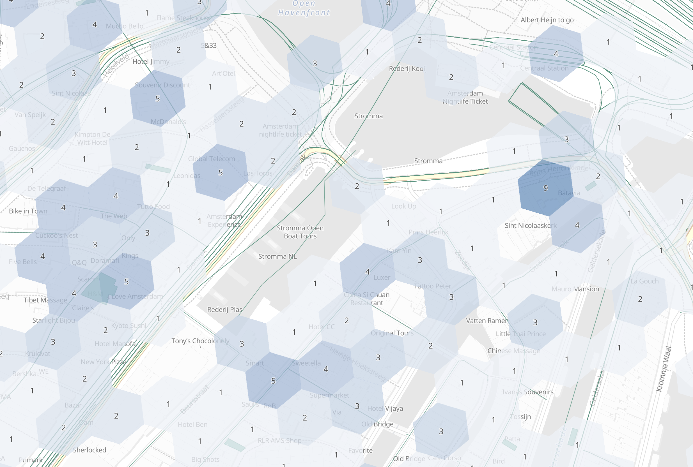

# Geohex grid aggregation [search-aggregations-bucket-geohexgrid-aggregation]


A multi-bucket aggregation that groups [`geo_point`](/reference/elasticsearch/mapping-reference/geo-point.md) and [`geo_shape`](/reference/elasticsearch/mapping-reference/geo-shape.md) values into buckets that represent a grid. The resulting grid can be sparse and only contains cells that have matching data. Each cell corresponds to a [H3 cell index](https://h3geo.org/docs/core-library/h3Indexing#h3-cell-indexp) and is labeled using the [H3Index representation](https://h3geo.org/docs/core-library/h3Indexing#h3index-representation).

See [the table of cell areas for H3 resolutions](https://h3geo.org/docs/core-library/restable) on how precision (zoom) correlates to size on the ground. Precision for this aggregation can be between 0 and 15, inclusive.

::::{warning}
High-precision requests can be very expensive in terms of RAM and result sizes. For example, the highest-precision geohex with a precision of 15 produces cells that cover less than one square meter. We recommend you use a filter to limit high-precision requests to a smaller geographic area. For an example, refer to [High-precision requests](#geohexgrid-high-precision).
::::


## Simple low-precision request [geohexgrid-low-precision]

$$$geohexgrid-aggregation-example$$$

```console
PUT /museums
{
  "mappings": {
    "properties": {
      "location": {
        "type": "geo_point"
      }
    }
  }
}

POST /museums/_bulk?refresh
{"index":{"_id":1}}
{"location": "POINT (4.912350 52.374081)", "name": "NEMO Science Museum"}
{"index":{"_id":2}}
{"location": "POINT (4.901618 52.369219)", "name": "Museum Het Rembrandthuis"}
{"index":{"_id":3}}
{"location": "POINT (4.914722 52.371667)", "name": "Nederlands Scheepvaartmuseum"}
{"index":{"_id":4}}
{"location": "POINT (4.405200 51.222900)", "name": "Letterenhuis"}
{"index":{"_id":5}}
{"location": "POINT (2.336389 48.861111)", "name": "Musée du Louvre"}
{"index":{"_id":6}}
{"location": "POINT (2.327000 48.860000)", "name": "Musée d'Orsay"}

POST /museums/_search?size=0
{
  "aggregations": {
    "large-grid": {
      "geohex_grid": {
        "field": "location",
        "precision": 4
      }
    }
  }
}
```

Response:

```console-result
{
  ...
  "aggregations": {
    "large-grid": {
      "buckets": [
        {
          "key": "841969dffffffff",
          "doc_count": 3
        },
        {
          "key": "841fb47ffffffff",
          "doc_count": 2
        },
        {
          "key": "841fa4dffffffff",
          "doc_count": 1
        }
      ]
    }
  }
}
```
% TESTRESPONSE[s/\.\.\./"took": $body.took,"_shards": $body._shards,"hits":$body.hits,"timed_out":false,/]


## High-precision requests [geohexgrid-high-precision]

When requesting detailed buckets (typically for displaying a "zoomed in" map), a filter like [geo_bounding_box](/reference/query-languages/query-dsl/query-dsl-geo-bounding-box-query.md) should be applied to narrow the subject area. Otherwise, potentially millions of buckets will be created and returned.

$$$geohexgrid-high-precision-ex$$$

```console
POST /museums/_search?size=0
{
  "aggregations": {
    "zoomed-in": {
      "filter": {
        "geo_bounding_box": {
          "location": {
            "top_left": "POINT (4.9 52.4)",
            "bottom_right": "POINT (5.0 52.3)"
          }
        }
      },
      "aggregations": {
        "zoom1": {
          "geohex_grid": {
            "field": "location",
            "precision": 12
          }
        }
      }
    }
  }
}
```
% TEST[continued]

Response:

```console-result
{
  ...
  "aggregations": {
    "zoomed-in": {
      "doc_count": 3,
      "zoom1": {
        "buckets": [
          {
            "key": "8c1969c9b2617ff",
            "doc_count": 1
          },
          {
            "key": "8c1969526d753ff",
            "doc_count": 1
          },
          {
            "key": "8c1969526d26dff",
            "doc_count": 1
          }
        ]
      }
    }
  }
}
```
% TESTRESPONSE[s/\.\.\./"took": $body.took,"_shards": $body._shards,"hits":$body.hits,"timed_out":false,/]


## Requests with additional bounding box filtering [geohexgrid-addtl-bounding-box-filtering]

The `geohex_grid` aggregation supports an optional `bounds` parameter that restricts the cells considered to those that intersect the provided bounds. The `bounds` parameter accepts the same [bounding box formats](/reference/query-languages/query-dsl/query-dsl-geo-bounding-box-query.md#query-dsl-geo-bounding-box-query-accepted-formats) as the geo-bounding box query. This bounding box can be used with or without an additional `geo_bounding_box` query for filtering the points prior to aggregating. It is an independent bounding box that can intersect with, be equal to, or be disjoint to any additional `geo_bounding_box` queries defined in the context of the aggregation.

$$$geohexgrid-aggregation-with-bounds$$$

```console
POST /museums/_search?size=0
{
  "aggregations": {
    "tiles-in-bounds": {
      "geohex_grid": {
        "field": "location",
        "precision": 12,
        "bounds": {
          "top_left": "POINT (4.9 52.4)",
          "bottom_right": "POINT (5.0 52.3)"
        }
      }
    }
  }
}
```
% TEST[continued]

Response:

```console-result
{
  ...
  "aggregations": {
    "tiles-in-bounds": {
      "buckets": [
        {
          "key": "8c1969c9b2617ff",
          "doc_count": 1
        },
        {
          "key": "8c1969526d753ff",
          "doc_count": 1
        },
        {
          "key": "8c1969526d26dff",
          "doc_count": 1
        }
      ]
    }
  }
}
```
% TESTRESPONSE[s/\.\.\./"took": $body.took,"_shards": $body._shards,"hits":$body.hits,"timed_out":false,/]


### Aggregating `geo_shape` fields [geohexgrid-aggregating-geo-shape]

Aggregating on [Geoshape](/reference/elasticsearch/mapping-reference/geo-shape.md) fields works almost as it does for points. There are two key differences:

* When aggregating over `geo_point` data, points are considered within a hexagonal tile if they lie within the edges defined by great circles. In other words the calculation is done using spherical coordinates. However, when aggregating over `geo_shape` data, the shapes are considered within a hexagon if they lie within the edges defined as straight lines on an equirectangular projection. The reason is that Elasticsearch and Lucene treat edges using the equirectangular projection at index and search time. In order to ensure that search results and aggregation results are aligned, we therefore also use equirectangular projection in aggregations. For most data, the difference is subtle or not noticed. However, for low zoom levels (low precision), especially far from the equator,  this can be noticeable. For example, if the same point data is indexed as `geo_point` and `geo_shape`, it is possible  to get different results when aggregating at lower resolutions.
* As is the case with [`geotile_grid`](/reference/aggregations/search-aggregations-bucket-geotilegrid-aggregation.md#geotilegrid-aggregating-geo-shape), a single shape can be counted for in multiple tiles. A shape will contribute to the count of matching values if any part of its shape intersects with that tile. Below is an image that demonstrates this:




## Options [_options_4]

field
:   (Required, string) Field containing indexed geo-point or geo-shape values. Must be explicitly mapped as a [`geo_point`](/reference/elasticsearch/mapping-reference/geo-point.md) or a [`geo_shape`](/reference/elasticsearch/mapping-reference/geo-shape.md) field. If the field contains an array, `geohex_grid` aggregates all array values.

precision
:   (Optional, integer) Integer zoom of the key used to define cells/buckets in the results. Defaults to `6`. Values outside of [`0`,`15`] will be rejected.

bounds
:   (Optional, object) Bounding box used to filter the geo-points or geo-shapes in each bucket. Accepts the same bounding box formats as the [geo-bounding box query](/reference/query-languages/query-dsl/query-dsl-geo-bounding-box-query.md#query-dsl-geo-bounding-box-query-accepted-formats).

size
:   (Optional, integer) Maximum number of buckets to return. Defaults to 10,000. When results are trimmed, buckets are prioritized based on the volume of documents they contain.

shard_size
:   (Optional, integer) Number of buckets returned from each shard. Defaults to `max(10,(size x number-of-shards))` to allow for a more accurate count of the top cells in the final result. Since each shard could have a different top result order, using a larger number here reduces the risk of inaccurate counts, but incurs a performance cost.


