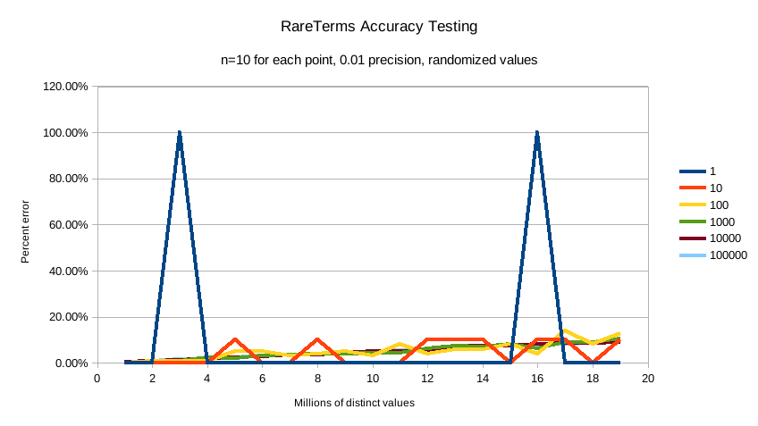
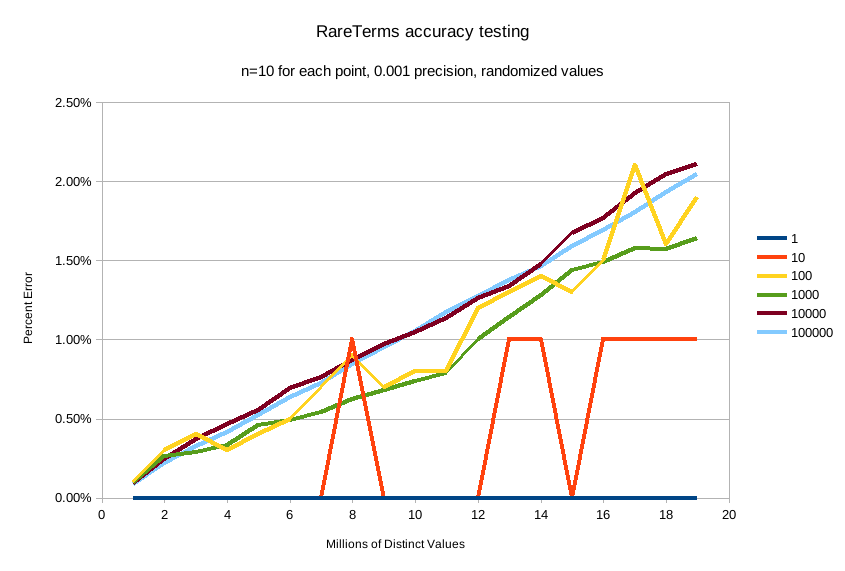
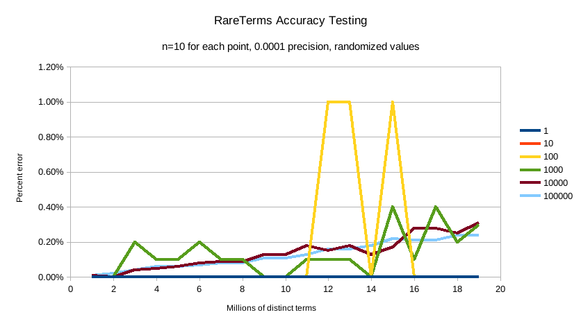
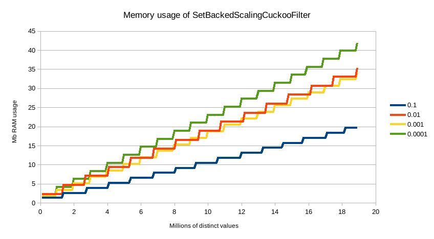

# Rare terms aggregation [search-aggregations-bucket-rare-terms-aggregation]


A multi-bucket value source based aggregation which finds "rare" terms — terms that are at the long-tail of the distribution and are not frequent. Conceptually, this is like a `terms` aggregation that is sorted by `_count` ascending. As noted in the [terms aggregation docs](/reference/aggregations/search-aggregations-bucket-terms-aggregation.md#search-aggregations-bucket-terms-aggregation-order), actually ordering a `terms` agg by count ascending has unbounded error. Instead, you should use the `rare_terms` aggregation

## Syntax [_syntax_3]

A `rare_terms` aggregation looks like this in isolation:

```js
{
  "rare_terms": {
    "field": "the_field",
    "max_doc_count": 1
  }
}
```

|     |     |     |     |
| --- | --- | --- | --- |
| Parameter Name | Description | Required | Default Value |
| `field` | The field we wish to find rare terms in | Required |  |
| `max_doc_count` | The maximum number of documents a term should appear in. | Optional | `1` |
| `precision` | The precision of the internal CuckooFilters. Smaller precision leads tobetter approximation, but higher memory usage. Cannot be smaller than `0.00001` | Optional | `0.001` |
| `include` | Terms that should be included in the aggregation | Optional |  |
| `exclude` | Terms that should be excluded from the aggregation | Optional |  |
| `missing` | The value that should be used if a document does not have the field being aggregated | Optional |  |

Example:

$$$rare-terms-aggregation-example$$$

```console
GET /_search
{
  "aggs": {
    "genres": {
      "rare_terms": {
        "field": "genre"
      }
    }
  }
}
```

Response:

```console-result
{
  ...
  "aggregations": {
    "genres": {
      "buckets": [
        {
          "key": "swing",
          "doc_count": 1
        }
      ]
    }
  }
}
```

In this example, the only bucket that we see is the "swing" bucket, because it is the only term that appears in one document. If we increase the `max_doc_count` to `2`, we’ll see some more buckets:

$$$rare-terms-aggregation-max-doc-count-example$$$

```console
GET /_search
{
  "aggs": {
    "genres": {
      "rare_terms": {
        "field": "genre",
        "max_doc_count": 2
      }
    }
  }
}
```

This now shows the "jazz" term which has a `doc_count` of 2":

```console-result
{
  ...
  "aggregations": {
    "genres": {
      "buckets": [
        {
          "key": "swing",
          "doc_count": 1
        },
        {
          "key": "jazz",
          "doc_count": 2
        }
      ]
    }
  }
}
```


## Maximum document count [search-aggregations-bucket-rare-terms-aggregation-max-doc-count]

The `max_doc_count` parameter is used to control the upper bound of document counts that a term can have. There is not a size limitation on the `rare_terms` agg like `terms` agg has. This means that terms which match the `max_doc_count` criteria will be returned. The aggregation functions in this manner to avoid the order-by-ascending issues that afflict the `terms` aggregation.

This does, however, mean that a large number of results can be returned if chosen incorrectly. To limit the danger of this setting, the maximum `max_doc_count` is 100.


## Max Bucket Limit [search-aggregations-bucket-rare-terms-aggregation-max-buckets]

The Rare Terms aggregation is more liable to trip the `search.max_buckets` soft limit than other aggregations due to how it works. The `max_bucket` soft-limit is evaluated on a per-shard basis while the aggregation is collecting results. It is possible for a term to be "rare" on a shard but become "not rare" once all the shard results are merged together. This means that individual shards tend to collect more buckets than are truly rare, because they only have their own local view. This list is ultimately pruned to the correct, smaller list of rare terms on the coordinating node…​ but a shard may have already tripped the `max_buckets` soft limit and aborted the request.

When aggregating on fields that have potentially many "rare" terms, you may need to increase the `max_buckets` soft limit. Alternatively, you might need to find a way to filter the results to return fewer rare values (smaller time span, filter by category, etc), or re-evaluate your definition of "rare" (e.g. if something appears 100,000 times, is it truly "rare"?)


## Document counts are approximate [search-aggregations-bucket-rare-terms-aggregation-approximate-counts]

The naive way to determine the "rare" terms in a dataset is to place all the values in a map, incrementing counts as each document is visited, then return the bottom `n` rows. This does not scale beyond even modestly sized data sets. A sharded approach where only the "top n" values are retained from each shard (ala the `terms` aggregation) fails because the long-tail nature of the problem means it is impossible to find the "top n" bottom values without simply collecting all the values from all shards.

Instead, the Rare Terms aggregation uses a different approximate algorithm:

1. Values are placed in a map the first time they are seen.
2. Each addition occurrence of the term increments a counter in the map
3. If the counter > the `max_doc_count` threshold, the term is removed from the map and placed in a [CuckooFilter](https://www.cs.cmu.edu/~dga/papers/cuckoo-conext2014.pdf)
4. The CuckooFilter is consulted on each term. If the value is inside the filter, it is known to be above the threshold already and skipped.

After execution, the map of values is the map of "rare" terms under the `max_doc_count` threshold. This map and CuckooFilter are then merged with all other shards. If there are terms that are greater than the threshold (or appear in a different shard’s CuckooFilter) the term is removed from the merged list. The final map of values is returned to the user as the "rare" terms.

CuckooFilters have the possibility of returning false positives (they can say a value exists in their collection when it actually does not). Since the CuckooFilter is being used to see if a term is over threshold, this means a false positive from the CuckooFilter will mistakenly say a value is common when it is not (and thus exclude it from it final list of buckets). Practically, this means the aggregations exhibits false-negative behavior since the filter is being used "in reverse" of how people generally think of approximate set membership sketches.

CuckooFilters are described in more detail in the paper:

[Fan, Bin, et al. "Cuckoo filter: Practically better than bloom."](https://www.cs.cmu.edu/~dga/papers/cuckoo-conext2014.pdf) Proceedings of the 10th ACM International on Conference on emerging Networking Experiments and Technologies. ACM, 2014.


## Precision [_precision]

Although the internal CuckooFilter is approximate in nature, the false-negative rate can be controlled with a `precision` parameter. This allows the user to trade more runtime memory for more accurate results.

The default precision is `0.001`, and the smallest (e.g. most accurate and largest memory overhead) is `0.00001`. Below are some charts which demonstrate how the accuracy of the aggregation is affected by precision and number of distinct terms.

The X-axis shows the number of distinct values the aggregation has seen, and the Y-axis shows the percent error. Each line series represents one "rarity" condition (ranging from one rare item to 100,000 rare items). For example, the orange "10" line means ten of the values were "rare" (`doc_count == 1`), out of 1-20m distinct values (where the rest of the values had `doc_count > 1`)

This first chart shows precision `0.01`:



And precision `0.001` (the default):



And finally `precision 0.0001`:



The default precision of `0.001` maintains an accuracy of < 2.5% for the tested conditions, and accuracy slowly degrades in a controlled, linear fashion as the number of distinct values increases.

The default precision of `0.001` has a memory profile of `1.748⁻⁶ * n` bytes, where `n` is the number of distinct values the aggregation has seen (it can also be roughly eyeballed, e.g. 20 million unique values is about 30mb of memory). The memory usage is linear to the number of distinct values regardless of which precision is chosen, the precision only affects the slope of the memory profile as seen in this chart:



For comparison, an equivalent terms aggregation at 20 million buckets would be roughly `20m * 69b == ~1.38gb` (with 69 bytes being a very optimistic estimate of an empty bucket cost, far lower than what the circuit breaker accounts for). So although the `rare_terms` agg is relatively heavy, it is still orders of magnitude smaller than the equivalent terms aggregation


## Filtering Values [_filtering_values]

It is possible to filter the values for which buckets will be created. This can be done using the `include` and `exclude` parameters which are based on regular expression strings or arrays of exact values. Additionally, `include` clauses can filter using `partition` expressions.

### Filtering Values with regular expressions [_filtering_values_with_regular_expressions]

$$$rare-terms-aggregation-regex-example$$$

```console
GET /_search
{
  "aggs": {
    "genres": {
      "rare_terms": {
        "field": "genre",
        "include": "swi*",
        "exclude": "electro*"
      }
    }
  }
}
```

In the above example, buckets will be created for all the tags that starts with `swi`, except those starting with `electro` (so the tag `swing` will be aggregated but not `electro_swing`). The `include` regular expression will determine what values are "allowed" to be aggregated, while the `exclude` determines the values that should not be aggregated. When both are defined, the `exclude` has precedence, meaning, the `include` is evaluated first and only then the `exclude`.

The syntax is the same as [regexp queries](/reference/query-languages/query-dsl/regexp-syntax.md).


### Filtering Values with exact values [_filtering_values_with_exact_values]

For matching based on exact values the `include` and `exclude` parameters can simply take an array of strings that represent the terms as they are found in the index:

$$$rare-terms-aggregation-exact-value-example$$$

```console
GET /_search
{
  "aggs": {
    "genres": {
      "rare_terms": {
        "field": "genre",
        "include": [ "swing", "rock" ],
        "exclude": [ "jazz" ]
      }
    }
  }
}
```


## Missing value [_missing_value_4]

The `missing` parameter defines how documents that are missing a value should be treated. By default they will be ignored but it is also possible to treat them as if they had a value.

$$$rare-terms-aggregation-missing-example$$$

```console
GET /_search
{
  "aggs": {
    "genres": {
      "rare_terms": {
        "field": "genre",
        "missing": "N/A" <1>
      }
    }
  }
}
```

1. Documents without a value in the `tags` field will fall into the same bucket as documents that have the value `N/A`.


## Nested, RareTerms, and scoring sub-aggregations [_nested_rareterms_and_scoring_sub_aggregations]

The RareTerms aggregation has to operate in `breadth_first` mode, since it needs to prune terms as doc count thresholds are breached. This requirement means the RareTerms aggregation is incompatible with certain combinations of aggregations that require `depth_first`. In particular, scoring sub-aggregations that are inside a `nested` force the entire aggregation tree to run in `depth_first` mode. This will throw an exception since RareTerms is unable to process `depth_first`.

As a concrete example, if `rare_terms` aggregation is the child of a `nested` aggregation, and one of the child aggregations of `rare_terms` needs document scores (like a `top_hits` aggregation), this will throw an exception.


