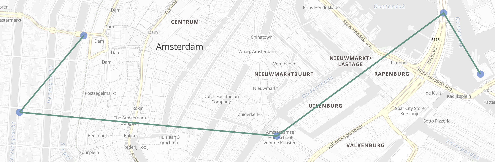
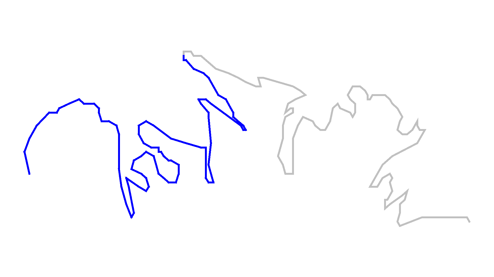
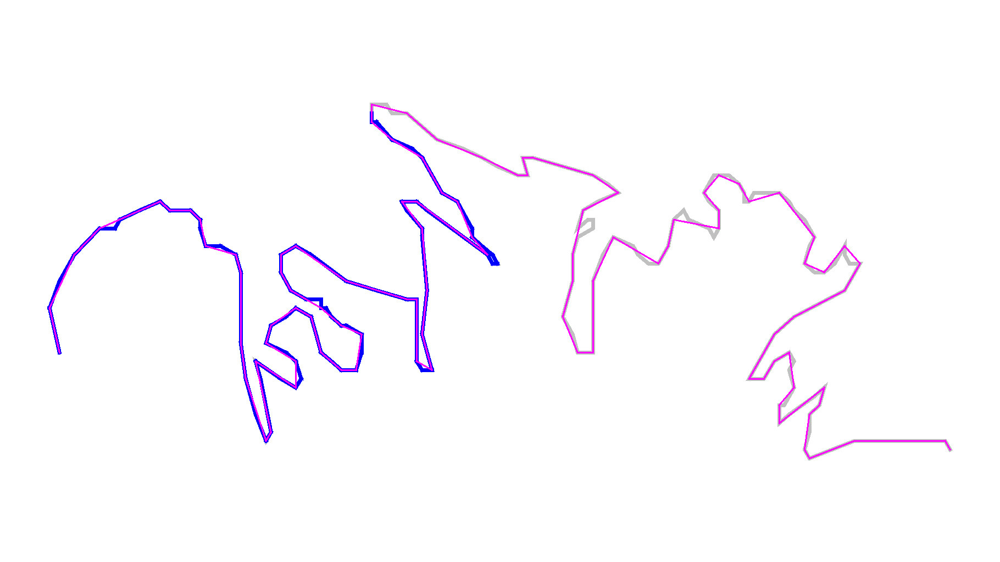

# Geo-line aggregation [search-aggregations-metrics-geo-line]


The `geo_line` aggregation aggregates all `geo_point` values within a bucket into a `LineString` ordered by the chosen `sort` field. This `sort` can be a date field, for example. The bucket returned is a valid [GeoJSON Feature](https://tools.ietf.org/html/rfc7946#section-3.2) representing the line geometry.

$$$search-aggregations-metrics-geo-line-simple$$$

```console
PUT test
{
    "mappings": {
        "properties": {
            "my_location": { "type": "geo_point" },
            "group":       { "type": "keyword" },
            "@timestamp":  { "type": "date" }
        }
    }
}

POST /test/_bulk?refresh
{"index":{}}
{"my_location": {"lat":52.373184, "lon":4.889187}, "@timestamp": "2023-01-02T09:00:00Z"}
{"index":{}}
{"my_location": {"lat":52.370159, "lon":4.885057}, "@timestamp": "2023-01-02T10:00:00Z"}
{"index":{}}
{"my_location": {"lat":52.369219, "lon":4.901618}, "@timestamp": "2023-01-02T13:00:00Z"}
{"index":{}}
{"my_location": {"lat":52.374081, "lon":4.912350}, "@timestamp": "2023-01-02T16:00:00Z"}
{"index":{}}
{"my_location": {"lat":52.371667, "lon":4.914722}, "@timestamp": "2023-01-03T12:00:00Z"}

POST /test/_search?filter_path=aggregations
{
  "aggs": {
    "line": {
      "geo_line": {
        "point": {"field": "my_location"},
        "sort":  {"field": "@timestamp"}
      }
    }
  }
}
```

Which returns:

```js
{
  "aggregations": {
    "line": {
      "type": "Feature",
      "geometry": {
        "type": "LineString",
        "coordinates": [
            [ 4.889187, 52.373184 ],
            [ 4.885057, 52.370159 ],
            [ 4.901618, 52.369219 ],
            [ 4.912350, 52.374081 ],
            [ 4.914722, 52.371667 ]
        ]
      },
      "properties": {
        "complete": true
      }
    }
  }
}
```

The resulting [GeoJSON Feature](https://tools.ietf.org/html/rfc7946#section-3.2) contains both a `LineString` geometry for the path generated by the aggregation, as well as a map of `properties`. The property `complete` informs of whether all documents matched were used to generate the geometry. The [`size` option](#search-aggregations-metrics-geo-line-size) can be used to limit the number of documents included in the aggregation, leading to results  with `complete: false`. Exactly which documents are dropped from results [depends on whether the aggregation is based on `time_series` or not](#search-aggregations-metrics-geo-line-grouping-time-series-advantages).

This result could be displayed in a map user interface:



## Options [search-aggregations-metrics-geo-line-options]

`point`
:   (Required)

This option specifies the name of the `geo_point` field

Example usage configuring `my_location` as the point field:

```js
"point": {
  "field": "my_location"
}
```

`sort`
:   (Required outside [`time_series`](#search-aggregations-metrics-geo-line-grouping-time-series) aggregations)

This option specifies the name of the numeric field to use as the sort key for ordering the points. When the `geo_line` aggregation is nested inside a [`time_series`](#search-aggregations-metrics-geo-line-grouping-time-series) aggregation, this field defaults to `@timestamp`, and any other value will result in error.

Example usage configuring `@timestamp` as the sort key:

```js
"sort": {
  "field": "@timestamp"
}
```

`include_sort`
:   (Optional, boolean, default: `false`) This option includes, when true, an additional array of the sort values in the feature properties.

`sort_order`
:   (Optional, string, default: `"ASC"`) This option accepts one of two values: "ASC", "DESC". The line is sorted in ascending order by the sort key when set to "ASC", and in descending with "DESC".

$$$search-aggregations-metrics-geo-line-size$$$

`size`
:   (Optional, integer, default: `10000`) The maximum length of the line represented in the aggregation. Valid sizes are between one and 10000. Within [`time_series`](#search-aggregations-metrics-geo-line-grouping-time-series) the aggregation uses line simplification to constrain the size, otherwise it uses truncation. Refer to [Why group with time-series?](#search-aggregations-metrics-geo-line-grouping-time-series-advantages) for a discussion on the subtleties involved.


## Grouping [search-aggregations-metrics-geo-line-grouping]

This simple example produces a single track for all the data selected by the query. However, it is far more common to need to group the data into multiple tracks. For example, grouping flight transponder measurements by flight call-sign before sorting each flight by timestamp and producing a separate track for each.

In the following examples we will group the locations of points of interest in the cities of Amsterdam, Antwerp and Paris. The tracks will be ordered by the planned visit sequence for a walking tour of the museums and others attractions.

In order to demonstrate the difference between a time-series grouping and a non-time-series grouping, we will first create an index with [time-series enabled](/reference/elasticsearch/index-settings/time-series.md), and then give examples of grouping the same data without time-series and with time-series.

$$$search-aggregations-metrics-geo-line-grouping-setup$$$

```console
PUT tour
{
    "mappings": {
        "properties": {
            "city": {
                "type": "keyword",
                "time_series_dimension": true
            },
            "category":   { "type": "keyword" },
            "route":      { "type": "long" },
            "name":       { "type": "keyword" },
            "location":   { "type": "geo_point" },
            "@timestamp": { "type": "date" }
        }
    },
    "settings": {
        "index": {
            "mode": "time_series",
            "routing_path": [ "city" ],
            "time_series": {
                "start_time": "2023-01-01T00:00:00Z",
                "end_time": "2024-01-01T00:00:00Z"
            }
        }
    }
}

POST /tour/_bulk?refresh
{"index":{}}
{"@timestamp": "2023-01-02T09:00:00Z", "route": 0, "location": "POINT(4.889187 52.373184)", "city": "Amsterdam", "category": "Attraction", "name": "Royal Palace Amsterdam"}
{"index":{}}
{"@timestamp": "2023-01-02T10:00:00Z", "route": 1, "location": "POINT(4.885057 52.370159)", "city": "Amsterdam", "category": "Attraction", "name": "The Amsterdam Dungeon"}
{"index":{}}
{"@timestamp": "2023-01-02T13:00:00Z", "route": 2, "location": "POINT(4.901618 52.369219)", "city": "Amsterdam", "category": "Museum", "name": "Museum Het Rembrandthuis"}
{"index":{}}
{"@timestamp": "2023-01-02T16:00:00Z", "route": 3, "location": "POINT(4.912350 52.374081)", "city": "Amsterdam", "category": "Museum", "name": "NEMO Science Museum"}
{"index":{}}
{"@timestamp": "2023-01-03T12:00:00Z", "route": 4, "location": "POINT(4.914722 52.371667)", "city": "Amsterdam", "category": "Museum", "name": "Nederlands Scheepvaartmuseum"}
{"index":{}}
{"@timestamp": "2023-01-04T09:00:00Z", "route": 5, "location": "POINT(4.401384 51.220292)", "city": "Antwerp", "category": "Attraction", "name": "Cathedral of Our Lady"}
{"index":{}}
{"@timestamp": "2023-01-04T12:00:00Z", "route": 6, "location": "POINT(4.405819 51.221758)", "city": "Antwerp", "category": "Museum", "name": "Snijders&Rockoxhuis"}
{"index":{}}
{"@timestamp": "2023-01-04T15:00:00Z", "route": 7, "location": "POINT(4.405200 51.222900)", "city": "Antwerp", "category": "Museum", "name": "Letterenhuis"}
{"index":{}}
{"@timestamp": "2023-01-05T10:00:00Z", "route": 8, "location": "POINT(2.336389 48.861111)", "city": "Paris", "category": "Museum", "name": "Musée du Louvre"}
{"index":{}}
{"@timestamp": "2023-01-05T14:00:00Z", "route": 9, "location": "POINT(2.327000 48.860000)", "city": "Paris", "category": "Museum", "name": "Musée dOrsay"}
```


## Grouping with terms [search-aggregations-metrics-geo-line-grouping-terms]

Using this data, for a non-time-series use case, the grouping can be done using a [terms aggregation](/reference/aggregations/search-aggregations-bucket-terms-aggregation.md) based on city name. This would work whether or not we had defined the `tour` index as a time series index.

$$$search-aggregations-metrics-geo-line-terms$$$

```console
POST /tour/_search?filter_path=aggregations
{
  "aggregations": {
    "path": {
      "terms": {"field": "city"},
      "aggregations": {
        "museum_tour": {
          "geo_line": {
            "point": {"field": "location"},
            "sort": {"field": "@timestamp"}
          }
        }
      }
    }
  }
}
```

Which returns:

```js
{
  "aggregations": {
    "path": {
      "doc_count_error_upper_bound": 0,
      "sum_other_doc_count": 0,
      "buckets": [
        {
          "key": "Amsterdam",
          "doc_count": 5,
          "museum_tour": {
            "type": "Feature",
            "geometry": {
              "coordinates": [ [ 4.889187, 52.373184 ], [ 4.885057, 52.370159 ], [ 4.901618, 52.369219 ], [ 4.91235, 52.374081 ], [ 4.914722, 52.371667 ] ],
              "type": "LineString"
            },
            "properties": {
              "complete": true
            }
          }
        },
        {
          "key": "Antwerp",
          "doc_count": 3,
          "museum_tour": {
            "type": "Feature",
            "geometry": {
              "coordinates": [ [ 4.401384, 51.220292 ], [ 4.405819, 51.221758 ], [ 4.4052, 51.2229 ] ],
              "type": "LineString"
            },
            "properties": {
              "complete": true
            }
          }
        },
        {
          "key": "Paris",
          "doc_count": 2,
          "museum_tour": {
            "type": "Feature",
            "geometry": {
              "coordinates": [ [ 2.336389, 48.861111 ], [ 2.327, 48.86 ] ],
              "type": "LineString"
            },
            "properties": {
              "complete": true
            }
          }
        }
      ]
    }
  }
}
```

These results contain an array of buckets, where each bucket is a JSON object with the `key` showing the name of the `city` field, and an inner aggregation result called `museum_tour` containing a [GeoJSON Feature](https://tools.ietf.org/html/rfc7946#section-3.2) describing the actual route between the various attractions in that city. Each result also includes a `properties` object with a `complete` value which will be `false` if the geometry was truncated to the limits specified in the `size` parameter. Note that when we use `time_series` in the next example, we will get the same results structured a little differently.


## Grouping with time-series [search-aggregations-metrics-geo-line-grouping-time-series]

::::{warning}
This functionality is in technical preview and may be changed or removed in a future release. Elastic will work to fix any issues, but features in technical preview are not subject to the support SLA of official GA features.
::::


Using the same data as before, we can also perform the grouping with a [`time_series` aggregation](/reference/aggregations/search-aggregations-bucket-time-series-aggregation.md). This will group by TSID, which is defined as the combinations of all fields with `time_series_dimension: true`, in this case the same `city` field used in the previous [terms aggregation](/reference/aggregations/search-aggregations-bucket-terms-aggregation.md). This example will only work if we defined the `tour` index as a time series index using  `index.mode="time_series"`.

$$$search-aggregations-metrics-geo-line-time-series$$$

```console
POST /tour/_search?filter_path=aggregations
{
  "aggregations": {
    "path": {
      "time_series": {},
      "aggregations": {
        "museum_tour": {
          "geo_line": {
            "point": {"field": "location"}
          }
        }
      }
    }
  }
}
```

::::{note}
The `geo_line` aggregation no longer requires the `sort` field when nested within a [`time_series` aggregation](/reference/aggregations/search-aggregations-bucket-time-series-aggregation.md). This is because the sort field is set to `@timestamp`, which all time-series indexes are pre-sorted by. If you do set this parameter, and set it to something other than `@timestamp` you will get an error.
::::


This query will result in:

```js
{
  "aggregations": {
    "path": {
      "buckets": {
        "{city=Paris}": {
          "key": {
            "city": "Paris"
          },
          "doc_count": 2,
          "museum_tour": {
            "type": "Feature",
            "geometry": {
              "coordinates": [ [ 2.336389, 48.861111 ], [ 2.327, 48.86 ] ],
              "type": "LineString"
            },
            "properties": {
              "complete": true
            }
          }
        },
        "{city=Antwerp}": {
          "key": {
            "city": "Antwerp"
          },
          "doc_count": 3,
          "museum_tour": {
            "type": "Feature",
            "geometry": {
              "coordinates": [ [ 4.401384, 51.220292 ], [ 4.405819, 51.221758 ], [ 4.4052, 51.2229 ] ],
              "type": "LineString"
            },
            "properties": {
              "complete": true
            }
          }
        },
        "{city=Amsterdam}": {
          "key": {
            "city": "Amsterdam"
          },
          "doc_count": 5,
          "museum_tour": {
            "type": "Feature",
            "geometry": {
              "coordinates": [ [ 4.889187, 52.373184 ], [ 4.885057, 52.370159 ], [ 4.901618, 52.369219 ], [ 4.91235, 52.374081 ], [ 4.914722, 52.371667 ] ],
              "type": "LineString"
            },
            "properties": {
              "complete": true
            }
          }
        }
      }
    }
  }
}
```

These results are essentially the same as with the previous `terms` aggregation example, but structured differently. Here we see the buckets returned as a map, where the key is an internal description of the TSID. This TSID is unique for each unique combination of fields with `time_series_dimension: true`. Each bucket contains a `key` field which is also a map of all dimension values for the TSID, in this case only the city name is used for grouping. In addition, there is an inner aggregation result called `museum_tour` containing a [GeoJSON Feature](https://tools.ietf.org/html/rfc7946#section-3.2) describing the actual route between the various attractions in that city. Each result also includes a `properties` object with a `complete` value which will be false if the geometry was simplified to the limits specified in the `size` parameter.


## Why group with time-series? [search-aggregations-metrics-geo-line-grouping-time-series-advantages]

When reviewing these examples, you might think that there is little difference between using [`terms`](/reference/aggregations/search-aggregations-bucket-terms-aggregation.md) or [`time_series`](/reference/aggregations/search-aggregations-bucket-time-series-aggregation.md) to group the geo-lines. However, there are some important differences in behaviour between the two cases. Time series indexes are stored in a very specific order on disk. They are pre-grouped by the time-series dimension fields, and pre-sorted by the `@timestamp` field. This allows the `geo_line` aggregation to be considerably optimized:

* The same memory allocated for the first bucket can be re-used over and over for all subsequent buckets. This is substantially less memory than required for non-time-series cases where all buckets are collected concurrently.
* No sorting needs to be done, since the data is pre-sorted by `@timestamp`. The time-series data will naturally arrive at the aggregation collector in `DESC` order. This means that if we specify `sort_order:ASC` (the default), we still collect in `DESC` order, but perform an efficient in-memory reverse order before generating the final `LineString` geometry.
* The `size` parameter can be used for a streaming line-simplification algorithm. Without time-series, we are forced to truncate data, by default after 10000 documents per bucket, in order to prevent memory usage from being unbounded. This can result in geo-lines being truncated, and therefor loosing important data. With time-series we can run a streaming line-simplification algorithm, retaining control over memory usage, while also maintaining the overall geometry shape. In fact, for most use cases it would work to set this `size` parameter to a much lower bound, and save even more memory. For example, if the `geo_line` is to be drawn on a display map with a specific resolution, it might look just as good to simplify to as few as 100 or 200 points. This will save memory on the server, on the network and in the client.

Note: There are other significant advantages to working with time-series data and using `time_series` index mode. These are discussed in the documentation on [time series data streams](docs-content://manage-data/data-store/data-streams/time-series-data-stream-tsds.md).


## Streaming line simplification [search-aggregations-metrics-geo-line-simplification]

Line simplification is a great way to reduce the size of the final results sent to the client, and displayed in a map user interface. However, normally these algorithms use a lot of memory to perform the simplification, requiring the entire geometry to be maintained in memory together with supporting data for the simplification itself. The use of a streaming line simplification algorithm allows for minimal memory usage during the simplification process by constraining memory to the bounds defined for the simplified geometry. This is only possible if no sorting is required, which is the case when grouping is done by the [`time_series` aggregation](/reference/aggregations/search-aggregations-bucket-time-series-aggregation.md), running on an index with the `time_series` index mode.

Under these conditions the `geo_line` aggregation allocates memory to the `size` specified, and then fills that memory with the incoming documents. Once the memory is completely filled, documents from within the line are removed as new documents are added. The choice of document to remove is made to minimize the visual impact on the geometry. This process makes use of the [Visvalingam–Whyatt algorithm](https://en.wikipedia.org/wiki/Visvalingam%E2%80%93Whyatt_algorithm). Essentially this means points are removed if they have the minimum triangle area, with the triangle defined by the point under consideration and the two points before and after it in the line. In addition, we calculate the area using spherical coordinates so that no planar distortions affect the choice.

In order to demonstrate how much better line simplification is to line truncation, consider this example of the north shore of Kodiak Island. The data for this is only 209 points, but if we want to set `size` to `100` we get dramatic truncation.



The grey line is the entire geometry of 209 points, while the blue line is the first 100 points, a very different geometry than the original.

Now consider the same geometry simplified to 100 points.



For comparison we have shown the original in grey, the truncated in blue and the new simplified geometry in magenta. It is possible to see where the new simplified line deviates from the original, but the overall geometry appears almost identical and is still clearly recognizable as the north shore of Kodiak Island.


