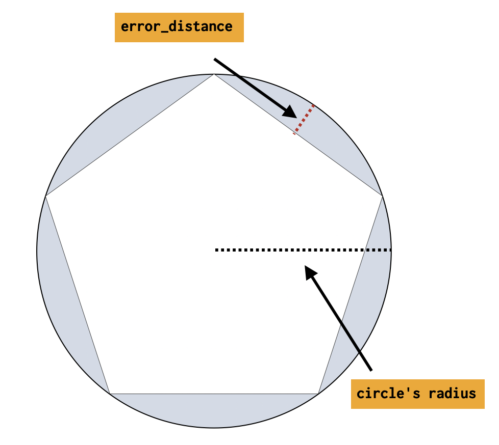

# Circle processor [ingest-circle-processor]


Converts circle definitions of shapes to regular polygons which approximate them.

$$$circle-processor-options$$$

| Name | Required | Default | Description |
| --- | --- | --- | --- |
| `field` | yes | - | The field to interpret as a circle. Either a string in WKT format or a map for GeoJSON. |
| `target_field` | no | `field` | The field to assign the polygon shape to, by default `field` is updated in-place |
| `ignore_missing` | no | `false` | If `true` and `field` does not exist, the processor quietly exits without modifying the document |
| `error_distance` | yes | - | The difference between the resulting inscribed distance from center to side and the circle’s radius (measured in meters for `geo_shape`, unit-less for `shape`) |
| `shape_type` | yes | - | Which field mapping type is to be used when processing the circle: `geo_shape` or `shape` |
| `description` | no | - | Description of the processor. Useful for describing the purpose of the processor or its configuration. |
| `if` | no | - | Conditionally execute the processor. See [Conditionally run a processor](docs-content://manage-data/ingest/transform-enrich/ingest-pipelines.md#conditionally-run-processor). |
| `ignore_failure` | no | `false` | Ignore failures for the processor. See [Handling pipeline failures](docs-content://manage-data/ingest/transform-enrich/ingest-pipelines.md#handling-pipeline-failures). |
| `on_failure` | no | - | Handle failures for the processor. See [Handling pipeline failures](docs-content://manage-data/ingest/transform-enrich/ingest-pipelines.md#handling-pipeline-failures). |
| `tag` | no | - | Identifier for the processor. Useful for debugging and metrics. |



```console
PUT circles
{
  "mappings": {
    "properties": {
      "circle": {
        "type": "geo_shape"
      }
    }
  }
}

PUT _ingest/pipeline/polygonize_circles
{
  "description": "translate circle to polygon",
  "processors": [
    {
      "circle": {
        "field": "circle",
        "error_distance": 28.0,
        "shape_type": "geo_shape"
      }
    }
  ]
}
```

Using the above pipeline, we can attempt to index a document into the `circles` index. The circle can be represented as either a WKT circle or a GeoJSON circle. The resulting polygon will be represented and indexed using the same format as the input circle. WKT will be translated to a WKT polygon, and GeoJSON circles will be translated to GeoJSON polygons.

::::{important}
Circles that contain a pole are not supported.
::::


## Example: Circle defined in Well Known Text [_example_circle_defined_in_well_known_text]

In this example a circle defined in WKT format is indexed

```console
PUT circles/_doc/1?pipeline=polygonize_circles
{
  "circle": "CIRCLE (30 10 40)"
}

GET circles/_doc/1
```
% TEST[continued]

The response from the above index request:

```console-result
{
  "found": true,
  "_index": "circles",
  "_id": "1",
  "_version": 1,
  "_seq_no": 22,
  "_primary_term": 1,
  "_source": {
    "circle": "POLYGON ((30.000365257263184 10.0, 30.000111397193788 10.00034284530941, 29.999706043744222 10.000213571721195, 29.999706043744222 9.999786428278805, 30.000111397193788 9.99965715469059, 30.000365257263184 10.0))"
  }
}
```
% TESTRESPONSE[s/"_seq_no": \d+/"_seq_no" : $body._seq_no/ s/"_primary_term": 1/"_primary_term" : $body._primary_term/]


## Example: Circle defined in GeoJSON [_example_circle_defined_in_geojson]

In this example a circle defined in GeoJSON format is indexed

```console
PUT circles/_doc/2?pipeline=polygonize_circles
{
  "circle": {
    "type": "circle",
    "radius": "40m",
    "coordinates": [30, 10]
  }
}

GET circles/_doc/2
```
% TEST[continued]

The response from the above index request:

```console-result
{
  "found": true,
  "_index": "circles",
  "_id": "2",
  "_version": 1,
  "_seq_no": 22,
  "_primary_term": 1,
  "_source": {
    "circle": {
      "coordinates": [
        [
          [30.000365257263184, 10.0],
          [30.000111397193788, 10.00034284530941],
          [29.999706043744222, 10.000213571721195],
          [29.999706043744222, 9.999786428278805],
          [30.000111397193788, 9.99965715469059],
          [30.000365257263184, 10.0]
        ]
      ],
      "type": "Polygon"
    }
  }
}
```
% TESTRESPONSE[s/"_seq_no": \d+/"_seq_no" : $body._seq_no/ s/"_primary_term": 1/"_primary_term" : $body._primary_term/]


## Notes on Accuracy [circle-processor-notes]

Accuracy of the polygon that represents the circle is defined as `error_distance`. The smaller this difference is, the closer to a perfect circle the polygon is.

Below is a table that aims to help capture how the radius of the circle affects the resulting number of sides of the polygon given different inputs.

The minimum number of sides is `4` and the maximum is `1000`.

$$$circle-processor-accuracy$$$

| error_distance | radius in meters | number of sides of polygon |
| --- | --- | --- |
| 1.00 | 1.0 | 4 |
| 1.00 | 10.0 | 14 |
| 1.00 | 100.0 | 45 |
| 1.00 | 1000.0 | 141 |
| 1.00 | 10000.0 | 445 |
| 1.00 | 100000.0 | 1000 |


