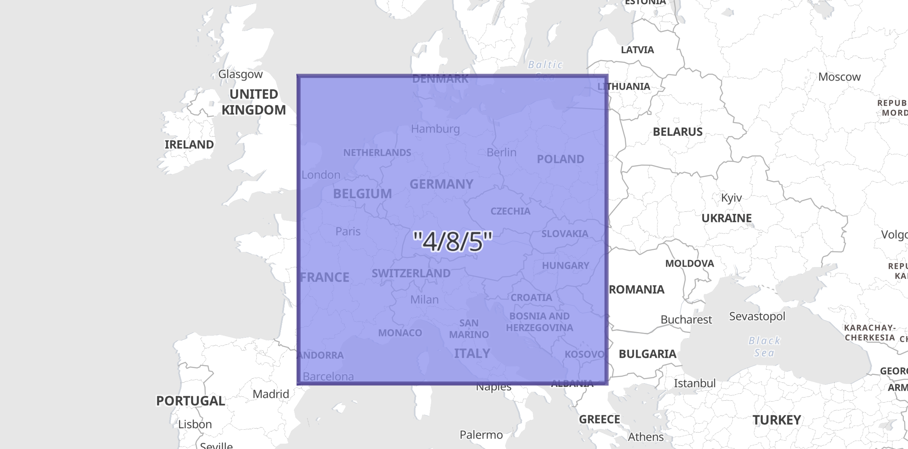

# Geo-grid processor [ingest-geo-grid-processor]


Converts geo-grid definitions of grid tiles or cells to regular bounding boxes or polygons which describe their shape. This is useful if there is a need to interact with the tile shapes as spatially indexable fields. For example the `geotile` field value `"4/8/3"` could be indexed as a string field, but that would not enable any spatial operations on it. Instead, convert it to the value `"POLYGON ((0.0 40.979898069620134, 22.5 40.979898069620134, 22.5 55.77657301866769, 0.0 55.77657301866769, 0.0 40.979898069620134))"`, which can be indexed as a [`geo_shape`](/reference/elasticsearch/mapping-reference/geo-shape.md) field.

$$$geo-grid-processor-options$$$

| Name | Required | Default | Description |
| --- | --- | --- | --- |
| `field` | yes | - | The field to interpret as a geo-tile. The field format is determined by the `tile_type`. |
| `tile_type` | yes | - | Three tile formats are understood: `geohash`, `geotile` and `geohex`. |
| `target_field` | no | `field` | The field to assign the polygon shape to, by default `field` is updated in-place. |
| `parent_field` | no | - | If specified and a parent tile exists, save that tile address to this field. |
| `children_field` | no | - | If specified and children tiles exist, save those tile addresses to this field as an array of strings. |
| `non_children_field` | no | - | If specified and intersecting non-child tiles exist, save their addresses to this field as an array of strings. |
| `precision_field` | no | - | If specified, save the tile precision (zoom) as an integer to this field. |
| `ignore_missing` | no | - | If `true` and `field` does not exist, the processor quietly exits without modifying the document. |
| `target_format` | no | "GeoJSON" | Which format to save the generated polygon in. Either `WKT` or `GeoJSON`. |
| `description` | no | - | Description of the processor. Useful for describing the purpose of the processor or its configuration. |
| `if` | no | - | Conditionally execute the processor. See [Conditionally run a processor](docs-content://manage-data/ingest/transform-enrich/ingest-pipelines.md#conditionally-run-processor). |
| `ignore_failure` | no | `false` | Ignore failures for the processor. See [Handling pipeline failures](docs-content://manage-data/ingest/transform-enrich/ingest-pipelines.md#handling-pipeline-failures). |
| `on_failure` | no | - | Handle failures for the processor. See [Handling pipeline failures](docs-content://manage-data/ingest/transform-enrich/ingest-pipelines.md#handling-pipeline-failures). |
| `tag` | no | - | Identifier for the processor. Useful for debugging and metrics. |

To demonstrate the usage of this ingest processor, consider an index called `geocells` with a mapping for a field `geocell` of type `geo_shape`. In order to populate that index using `geotile` and `geohex` fields, define two ingest processors:

```console
PUT geocells
{
  "mappings": {
    "properties": {
      "geocell": {
        "type": "geo_shape"
      }
    }
  }
}

PUT _ingest/pipeline/geotile2shape
{
  "description": "translate rectangular z/x/y geotile to bounding box",
  "processors": [
    {
      "geo_grid": {
        "field": "geocell",
        "tile_type": "geotile"
      }
    }
  ]
}

PUT _ingest/pipeline/geohex2shape
{
  "description": "translate H3 cell to polygon",
  "processors": [
    {
      "geo_grid": {
        "field": "geocell",
        "tile_type": "geohex",
        "target_format": "wkt"
      }
    }
  ]
}
```

These two pipelines can be used to index documents into the `geocells` index. The `geocell` field will be the string version of either a rectangular tile with format `z/x/y` or an H3 cell address, depending on which ingest processor we use when indexing the document. The resulting geometry will be represented and indexed as a [`geo_shape`](/reference/elasticsearch/mapping-reference/geo-shape.md) field in either [GeoJSON](http://geojson.org) or the [Well-Known Text](https://docs.opengeospatial.org/is/12-063r5/12-063r5.html) format.

## Example: Rectangular geotile with envelope in GeoJSON [_example_rectangular_geotile_with_envelope_in_geojson]

In this example a `geocell` field with a value defined in `z/x/y` format is indexed as a [GeoJSON Envelope](http://geojson.org) since the ingest-processor above was defined with default `target_format`.

```console
PUT geocells/_doc/1?pipeline=geotile2shape
{
  "geocell": "4/8/5"
}

GET geocells/_doc/1
```
% TEST[continued]

The response shows how the ingest-processor has replaced the `geocell` field with an indexable `geo_shape`:

```console-result
{
 "_index": "geocells",
  "_id": "1",
  "_version": 1,
  "_seq_no": 0,
  "_primary_term": 1,
  "found": true,
  "_source": {
    "geocell": {
      "type": "Envelope",
      "coordinates": [
        [ 0.0, 55.77657301866769 ],
        [ 22.5, 40.979898069620134 ]
      ]
    }
  }
}
```
% TESTRESPONSE[s/"_version": \d+/"_version": $body._version/ s/"_seq_no": \d+/"_seq_no": $body._seq_no/ s/"_primary_term": 1/"_primary_term": $body._primary_term/]




## Example: Hexagonal geohex with polygon in WKT format [_example_hexagonal_geohex_with_polygon_in_wkt_format]

In this example a `geocell` field with an H3 string address is indexed as a [WKT Polygon](https://docs.opengeospatial.org/is/12-063r5/12-063r5.html), since this ingest processor explicitly defined the `target_format`.

```console
PUT geocells/_doc/1?pipeline=geohex2shape
{
  "geocell": "811fbffffffffff"
}

GET geocells/_doc/1
```
% TEST[continued]

The response shows how the ingest-processor has replaced the `geocell` field with an indexable `geo_shape`:

```console-result
{
 "_index": "geocells",
  "_id": "1",
  "_version": 1,
  "_seq_no": 0,
  "_primary_term": 1,
  "found": true,
  "_source": {
    "geocell": "POLYGON ((1.1885095294564962 49.470279179513454, 2.0265689212828875 45.18424864858389, 7.509948452934623 43.786609335802495, 12.6773177459836 46.40695743262768, 12.345747342333198 50.55427505169064, 6.259687012061477 51.964770150370896, 3.6300085578113794 50.610463307239115, 1.1885095294564962 49.470279179513454))"
  }
}
```
% TESTRESPONSE[s/"_version": \d+/"_version": $body._version/ s/"_seq_no": \d+/"_seq_no": $body._seq_no/ s/"_primary_term": 1/"_primary_term": $body._primary_term/]


## Example: Enriched tile details [_example_enriched_tile_details]

As described in [geo_grid processor options](#geo-grid-processor-options), there are many other fields that can be set, which will enrich the information available. For example, with H3 tiles there are 7 child tiles, but only the first is fully contained by the parent. The remaining six are only partially overlapping the parent, and there exist a further six non-child tiles that overlap the parent. This can be investigated by adding parent and child additional fields to the ingest-processor:

```console
PUT _ingest/pipeline/geohex2shape
{
  "description": "translate H3 cell to polygon with enriched fields",
  "processors": [
    {
      "geo_grid": {
        "description": "Ingest H3 cells like '811fbffffffffff' and create polygons",
        "field": "geocell",
        "tile_type": "geohex",
        "target_format": "wkt",
        "target_field": "shape",
        "parent_field": "parent",
        "children_field": "children",
        "non_children_field": "nonChildren",
        "precision_field": "precision"
      }
    }
  ]
}
```

Index the document to see a different result:

```console
PUT geocells/_doc/1?pipeline=geohex2shape
{
  "geocell": "811fbffffffffff"
}

GET geocells/_doc/1
```
% TEST[continued]

The response from this index request:

```console-result
{
  "_index": "geocells",
  "_id": "1",
  "_version": 1,
  "_seq_no": 0,
  "_primary_term": 1,
  "found": true,
  "_source": {
    "parent": "801ffffffffffff",
    "geocell": "811fbffffffffff",
    "precision": 1,
    "shape": "POLYGON ((1.1885095294564962 49.470279179513454, 2.0265689212828875 45.18424864858389, 7.509948452934623 43.786609335802495, 12.6773177459836 46.40695743262768, 12.345747342333198 50.55427505169064, 6.259687012061477 51.964770150370896, 3.6300085578113794 50.610463307239115, 1.1885095294564962 49.470279179513454))",
    "children": [
      "821f87fffffffff",
      "821f8ffffffffff",
      "821f97fffffffff",
      "821f9ffffffffff",
      "821fa7fffffffff",
      "821faffffffffff",
      "821fb7fffffffff"
    ],
    "nonChildren": [
      "821ea7fffffffff",
      "82186ffffffffff",
      "82396ffffffffff",
      "821f17fffffffff",
      "821e37fffffffff",
      "82194ffffffffff"
    ]
  }
}
```
% TESTRESPONSE[s/"_version": \d+/"_version": $body._version/ s/"_seq_no": \d+/"_seq_no": $body._seq_no/ s/"_primary_term": 1/"_primary_term": $body._primary_term/]

This additional information will then enable, for example, creating a visualization of the H3 cell, its children and its intersecting non-children cells.


