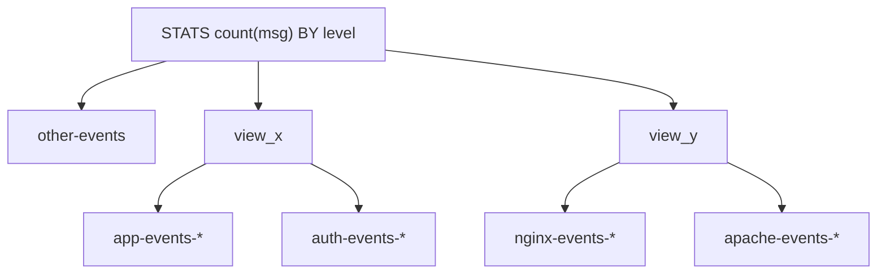
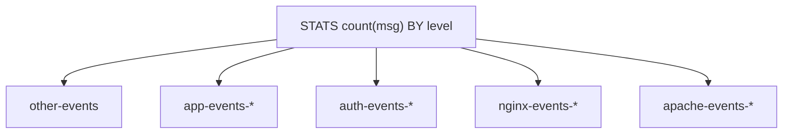

# {{esql}} Views [esql-views]

A view is a virtual index with fields that are produced from the output of an ES|QL query.
Each view has a name and a definition. The definition is a complete ES|QL query, with source commands and processing commands.
The view name can be used within an index pattern in the [`FROM`](/reference/query-languages/esql/commands/from.md) command of any normal ES|QL query, as well as within another view definition.
When the main query is executed, all referenced views are also executed independently.
This ensures up-to-date results from all source indexes referenced by both the main query and the view definitions themselves.
The final output combines all these results into a single list, including any duplicate rows.

## When to use views

Views are a good fit when you want to:

* **Reuse a named query.** Wrap a frequently used ES|QL pipeline as a view and reference it by name, instead of repeating the same query in every request.
* **Abstract common transformations.** Centralize renames, type conversions, or derived fields so consumers see a consistent set of columns without needing to know the underlying source structure.
* **Combine pre-processed data sources.** Define one view per source, each with its own filters or aggregations, and query them together in a single `FROM` clause.
* **Simplify queries for downstream tools.** Dashboards, alerts, or ad-hoc analysts can query `FROM my_view` without needing to know the indices or processing commands behind it.

## Defining views

Define a view using the REST API:
* [Create or update an ES|QL View](https://www.elastic.co/docs/api/doc/elasticsearch/operation/operation-esql-put-view)
* [Delete an ES|QL View](https://www.elastic.co/docs/api/doc/elasticsearch/operation/operation-esql-delete-view)
* [Get or list ES|QL Views](https://www.elastic.co/docs/api/doc/elasticsearch/operation/operation-esql-get-view)

For example, consider the following ES|QL query:

:::{include} _snippets/commands/examples/views.csv-spec/views_plain_addresses.md
:::

We can define a view called `country_addresses` using that query:

```console
PUT /_query/view/country_addresses
{
    "query": """
        FROM addresses
        | RENAME city.country.name AS country
        | EVAL country = CASE(country == "United States of America", "United States", country)
        | STATS count=COUNT() BY country
        """
}
```

Now a query like `FROM country_addresses` will produce the same output:

:::{include} _snippets/commands/examples/views.csv-spec/views_country_addresses.md
:::

## Using views

Use views as if they were ordinary indices:

```esql
FROM index_pattern
```

Where `index_pattern` is a comma-separated list of index or view names, including
wildcards and date-math.

Much like [subqueries](/reference/query-languages/esql/esql-subquery.md),
views enable you to combine results from multiple independently processed
data sources within a single query. Each view runs its own pipeline of
processing commands (such as `WHERE`, `EVAL`, `STATS`, or `SORT`) and the
results are combined together with results from other index patterns, views or subqueries
in the `FROM` clause.

Fields that exist in one source but not another are filled with `null` values.

### Nesting and branching

If a view definition contains a reference to another view, that is called a nested view.
ES|QL allows nesting to a depth of 10.
When multiple views are referenced within the same index-pattern, this leads
to a branched query plan where each view will be executed independently, in parallel
if possible, similar to subqueries and [`FORK`](/reference/query-languages/esql/commands/fork.md).
There is a maximum allowed branching factor of 8, for the combination of views, subqueries and `FORK`.
So, for example, a single index pattern could reference four views and four subqueries,
but adding just one more view or subquery would exceed the allowed limit and the query will fail.

Branching and nesting are allowed in combination as long as there is never more than one branch point.
This means that nested branching has restrictions:
* A view can contain subqueries, but that view cannot be used together with other views, and the subqueries can only reference nested views that contain no further branching.
* A subquery can contain views, but those views must not introduce any additional branch points via subqueries or `FORK`

### Limitations and known issues

Views have certain limitations:
* Commands that also generate branched query plans are usually not allowed within views, unless the branch points can be merged:
  * `FORK`
  * [subqueries](esql-subquery.md)
* [Cross-cluster search](esql-cross-clusters.md):
  * Remote views in CCS are not allowed (ie. `FROM cluster:view` will only match remote indexes with the name `view`. If a remote view is found, the query will fail).
  * If a remote index matches a local view name, the query will fail.
* Serverless and Cross-project search:
  * Views are initially unavailable in serverless
* Query parameters are not allowed in the view definition, and therefore query parameters in the main query will never impact the view results.

Views are in tech-preview and there are a number of known issues, or behavior that is likely to change in the future:
* Query DSL filtering on the main query will currently affect the source indices in the view definition, and this will change in later releases.
  * The future design will have the query filtering impact the output of the view, not the source indices
* METADATA directives inside and outside a view definition behave the same as they do for
  [`METADATA` in subqueries](/reference/query-languages/esql/esql-subquery.md#subqueries-with-metadata). This will change for views.

## Examples

The following examples show how to use views within the `FROM` command.

### Combine data from multiple indices

Assume we've defined three views in a similar way to the example above, each counting the number of documents that reference a particular country, but from three different source indices:
* `country_airports` - reports counts of documents per country from our `airports` index
* `country_addresses` - reports counts of documents per country from our `addresses` index
* `country_languages` - reports counts of documents per country from our `languages` index

Now we can query these together with a query like:

:::{include} _snippets/commands/examples/views.csv-spec/views_country_filtered.md
:::

The same country might appear in multiple views, producing multiple rows.
We could combine these with a `STATS` command, using `SUM(count) BY country`.

### Using wildcards

:::{include} _snippets/commands/examples/views.csv-spec/views_country_wildcard_sum.md
:::

Note how we used `SUM` to combine the counts of the three previously aggregated `count` columns.

### Use LOOKUP JOIN inside a view

We can define views with complex queries, including commands like `LOOKUP JOIN`:

```console
PUT /_query/view/airports_mp_filtered
{
    "query": """
        FROM airports
        | RENAME abbrev AS code
        | LOOKUP JOIN airports_mp ON abbrev == code
        | WHERE abbrev IS NOT NULL
        | DROP code
       """
}
```

This creates a view called `airports_mp_filtered` that contains all rows from the `airports` index that also have a matching `abbrev` inside the `airports_mp` index.
This is effectively a subset of the `airports` index.

We could, for example, see how many airports are defined only in `airports` versus how many are defined in the view, by combining both a view and an index in the same `FROM` command:

:::{include} _snippets/commands/examples/views.csv-spec/airports_mp_filtered_combined.md
:::

### Views with METADATA

The [`METADATA` directive](/reference/query-languages/esql/esql-metadata-fields.md) is supported both inside and outside a view, and
follows the same rules as observed for [`METADATA` in Subqueries](/reference/query-languages/esql/esql-subquery.md#subqueries-with-metadata).
Inside the view it generates columns, just like other fields, and these can be used for filtering and as output columns.

Outside the view it generates `null` values.
Note that this is a known limitation of the current tech-preview, and is anticipated to be addressed in a future update,
at which point `METADATA _index` will contain the name of the view.

## Comparing views, subqueries and FORK

:::{include} _snippets/common/comparing_views_subqueries_fork.md
:::

## Query compaction

Consider two views, each defined as a pair of subqueries:

```console
PUT /_query/view/view_x
{
    "query": """
        FROM (
            FROM app-events-* | KEEP msg, level
        ), (
            FROM auth-events-* | KEEP msg, level
        )
       """
}
```

```console
PUT /_query/view/view_y
{
    "query": """
        FROM (
            FROM nginx-events-* | KEEP msg, level
        ), (
            FROM apache-events-* | KEEP msg, level
        )
       """
}
```

Used together in a single `FROM` clause:

```esql
FROM other-events, view_x, view_y
| STATS count(msg) BY level
```

This initially resolves to a plan with two levels of branching — three outer branches, two of which branch again inside their view definitions:



ES|QL allows only one branch level per query, so the equivalent subquery-only form would fail. Views, however, apply **query compaction**: the inner view branches are flattened into the outer branch set, producing a single-level plan with five branches:



Compaction does **not** apply if the view definition contains any commands after its subqueries — those commands would need to run on the combined branch output, so the branch level cannot be collapsed and the query will fail.

## Related pages

* [Query multiple sources](/reference/query-languages/esql/esql-multi.md): high-level overview of combining data from multiple indices, clusters, subqueries, and views.
* [Combine result sets with subqueries](/reference/query-languages/esql/esql-subquery.md): the closest alternative to views, without a persisted definition.
* [`FROM` command](/reference/query-languages/esql/commands/from.md): full reference for index expressions, where view names are used.
* [`FORK` command](/reference/query-languages/esql/commands/fork.md): the other branching construct in ES|QL, which shares the branching limits described above.
* [Query multiple indices](/reference/query-languages/esql/esql-multi-index.md): how index patterns, wildcards, and date math combine sources in a single `FROM`.
