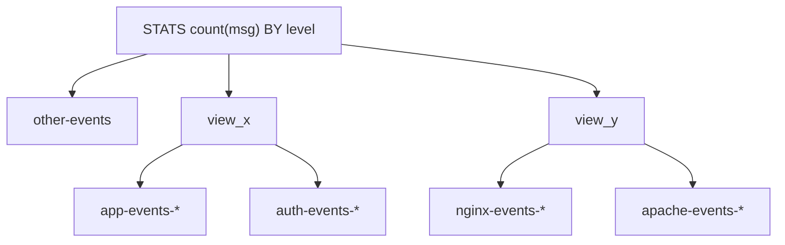
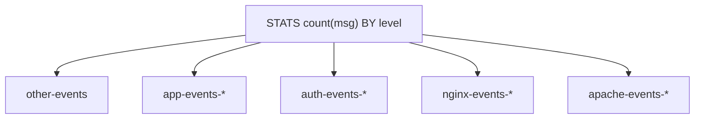

# Define reusable queries with {{esql}} views [esql-views]

A view is a virtual index defined by an ES|QL query. You reference a view by name in the [`FROM`](/reference/query-languages/esql/commands/from.md) command, just like an ordinary index. The query runs each time the view is referenced, so results always reflect the current state of the data.

A view has two components:

* **Name**: unique within the index namespace, used anywhere an index name is accepted in `FROM`.
* **Definition**: a complete ES|QL query that runs each time the view is referenced.

## Basic example

Here's how a view works in practice:

:::::::{stepper}

::::::{step} Start with a query

:::{include} _snippets/commands/examples/views.csv-spec/views_plain_addresses.md
:::

::::::

::::::{step} Save it as a view

```console
PUT /_query/view/country_addresses
{
    "query": """
        FROM addresses
        | RENAME city.country.name AS country
        | EVAL country = CASE(country == "United States of America", "United States", country)
        | STATS count=COUNT() BY country
        """
}
```

::::::

::::::{step} Reference it by name, just like an index

:::{include} _snippets/commands/examples/views.csv-spec/views_country_addresses.md
:::

::::::

:::::::

## When to use views

Views are a good fit when you want to:

* **Reuse a named query.** Wrap a frequently used ES|QL pipeline as a view and reference it by name, instead of repeating the same query in every request.
* **Abstract common transformations.** Centralize renames, type conversions, or derived fields so consumers see a consistent set of columns without needing to know the underlying source structure.
* **Combine pre-processed data sources.** Define one view per source, each with its own filters or aggregations, and query them together in a single `FROM` clause.
* **Simplify queries for downstream tools.** Dashboards, alerts, or ad-hoc analysts can query `FROM my_view` without needing to know the indices or processing commands behind it.

## Create and manage views

Use the REST API to create, update, delete, and list views:

* [Create or update a view](https://www.elastic.co/docs/api/doc/elasticsearch/operation/operation-esql-put-view)
* [Delete a view](https://www.elastic.co/docs/api/doc/elasticsearch/operation/operation-esql-delete-view)
* [Get or list views](https://www.elastic.co/docs/api/doc/elasticsearch/operation/operation-esql-get-view)

## Query a view

Use views as if they were ordinary indices:

```esql
FROM index_pattern
```

Where `index_pattern` is a comma-separated list of index or view names, including
wildcards and date-math.

## Privileges [esql-views-privileges]

View operations use the standard {{es}} [index privileges](../../elasticsearch/security-privileges.md#privileges-list-indices), applied to the view name.

| Operation | Privilege (on the view name) |
|---|---|
| Query (`FROM my_view`) | `read`, `all` |
| Create or update (`PUT /_query/view/<name>`) | `create_view`, `manage_view`, `manage`, `all` |
| Read definition (`GET /_query/view/<name>`) | `read_view_metadata`, `manage_view`, `manage`, `all` |
| Delete (`DELETE /_query/view/<name>`) | `delete_view`, `manage_view`, `manage`, `all` |

### Views are not a security boundary

`read` on a view name permits querying the view but does **not** grant access to the data behind it. The caller must also have `read` on every index or alias the view definition resolves to, including through nested views.

Access is enforced at query time. Creating a view requires no privilege over the indices it references.

If some underlying indices are unauthorized, the query fails with a `403`. If none are accessible, it fails with a `400 Unknown index`. Wildcard patterns (`FROM view-*`) silently exclude unauthorized views.

Nested views are resolved under the calling user's credentials. Access to an outer view does not grant access to any inner view it references.

### Document- and field-level security

`read` on a view name must not carry DLS or FLS. If it does, the query fails with a `403` and the `views_with_dls_or_fls` error field lists the affected names. This applies at every nesting level.

DLS or FLS on the **underlying indices** is applied normally.

### Example role

```json
{
  "indices": [
    {
      "names": ["country_addresses"],
      "privileges": ["read", "create_view", "read_view_metadata", "delete_view"]
    },
    {
      "names": ["addresses"],
      "privileges": ["read"]
    }
  ]
}
```

## Examples

The following examples show how to use views within the `FROM` command.

### Combine data from multiple indices

Assume we've defined three views in a similar way to the example above, each counting the number of documents that reference a particular country, but from three different source indices:
* `country_airports` - reports counts of documents per country from our `airports` index
* `country_addresses` - reports counts of documents per country from our `addresses` index
* `country_languages` - reports counts of documents per country from our `languages` index

Now we can query these together with a query like:

:::{include} _snippets/commands/examples/views.csv-spec/views_country_filtered.md
:::

The same country might appear in multiple views, producing multiple rows.
We could combine these with a `STATS` command, using `SUM(count) BY country`.

### Use wildcards

:::{include} _snippets/commands/examples/views.csv-spec/views_country_wildcard_sum.md
:::

Note how we used `SUM` to combine the counts of the three previously aggregated `count` columns.

### Use LOOKUP JOIN inside a view

We can define views with complex queries, including commands like `LOOKUP JOIN`:

```console
PUT /_query/view/airports_mp_filtered
{
    "query": """
        FROM airports
        | RENAME abbrev AS code
        | LOOKUP JOIN airports_mp ON abbrev == code
        | WHERE abbrev IS NOT NULL
        | DROP code
       """
}
```

This creates a view called `airports_mp_filtered` that contains all rows from the `airports` index that also have a matching `abbrev` inside the `airports_mp` index.
This is effectively a subset of the `airports` index.

We could, for example, see how many airports are defined only in `airports` versus how many are defined in the view, by combining both a view and an index in the same `FROM` command:

:::{include} _snippets/commands/examples/views.csv-spec/airports_mp_filtered_combined.md
:::

### Views with METADATA

The [`METADATA` directive](/reference/query-languages/esql/esql-metadata-fields.md) is supported both inside and outside a view, and
follows the same rules as observed for [`METADATA` in subqueries](/reference/query-languages/esql/esql-from-subquery.md#subqueries-with-metadata).
Inside the view it generates columns, just like other fields, and these can be used for filtering and as output columns.

Outside the view it generates `null` values.
Note that this is a known limitation of the current tech-preview, and is anticipated to be addressed in a future update,
at which point `METADATA _index` will contain the name of the view.

## How views execute

Views behave like inline subqueries at execution time and when you start combining multiple views, it helps to know how nesting works and where the limits are.

### Execution model

When a query references one or more views, each view's definition query executes independently at query time, in parallel where possible. This is the same execution model used by [`FROM` subqueries](/reference/query-languages/esql/esql-from-subquery.md) and [`FORK`](/reference/query-languages/esql/commands/fork.md).

Results from all sources (indices, views, subqueries) are unioned into a single result set. Duplicate rows are preserved. Columns that exist in one source but not another are filled with `null`.

### Nesting and branching

A view definition can reference another view. This is called a nested view. ES|QL allows nesting to a depth of 10.

When multiple views are referenced within the same index pattern, each view executes independently (in parallel if possible), similar to subqueries and [`FORK`](/reference/query-languages/esql/commands/fork.md). Views, subqueries, and `FORK` share a maximum branch count of 8. For example, a single index pattern could reference four views and four subqueries, but adding one more would exceed the limit and the query will fail.

Branching and nesting are allowed in combination as long as there is never more than one branch point. This means nested branching has restrictions:

* A view can contain subqueries, but that view cannot be used together with other views, and the subqueries can only reference nested views that contain no further branching.
* A subquery can contain views, but those views must not introduce any additional branch points via subqueries or `FORK`.

### Query compaction

When a view definition itself contains branches (subqueries or references to other views), those inner branches would normally create a second level of branching, which ES|QL does not allow. Query compaction solves this by flattening the inner branches into the outer branch set, producing a single-level plan.

The following example shows how compaction works. Two views are each defined as a pair of subqueries:

```console
PUT /_query/view/view_x
{
    "query": """
        FROM (
            FROM app-events-* | KEEP msg, level
        ), (
            FROM auth-events-* | KEEP msg, level
        )
       """
}
```

```console
PUT /_query/view/view_y
{
    "query": """
        FROM (
            FROM nginx-events-* | KEEP msg, level
        ), (
            FROM apache-events-* | KEEP msg, level
        )
       """
}
```

A query references both views alongside a regular index:

```esql
FROM other-events, view_x, view_y
| STATS count(msg) BY level
```

Without compaction, this would create two levels of branching. Three outer branches exist, and two of them branch again inside their view definitions:


```mermaid
flowchart TD
    S["STATS count(msg) BY level"]
    S --> O["other-events"]
    S --> VX["view_x"]
    S --> VY["view_y"]
    VX --> AX["app-events-*"]
    VX --> AU["auth-events-*"]
    VY --> NG["nginx-events-*"]
    VY --> AP["apache-events-*"]
```

Compaction flattens the inner view branches into the outer branch set, producing a single-level plan with five branches:


```mermaid
flowchart TD
    S["STATS count(msg) BY level"]
    S --> O["other-events"]
    S --> AX["app-events-*"]
    S --> AU["auth-events-*"]
    S --> NG["nginx-events-*"]
    S --> AP["apache-events-*"]
```

Compaction does **not** apply if the view definition contains any processing commands after its subqueries. Those commands need to run on the combined branch output, so the branch level cannot be collapsed and the query will fail.

## Limitations [esql-views-limitations]

ES|QL views have the following limitations:

:::{include} _snippets/common/view_limitations.md
:::

## Compare views, subqueries, and FORK

For a detailed comparison of views, subqueries, and `FORK`, refer to [Combine and reuse ES|QL queries](/reference/query-languages/esql/esql-combine-reuse-queries.md#comparing-views-subqueries-and-fork).

## Related pages

* [ES|QL subqueries](/reference/query-languages/esql/esql-subquery.md): nest queries inside other queries, either in `FROM` or `WHERE`.
* [`FROM` command](/reference/query-languages/esql/commands/from.md): full reference for index expressions, where view names are used.
* [Query multiple indices](/reference/query-languages/esql/esql-multi-index.md): how index patterns, wildcards, and date math combine sources in a single `FROM`.
