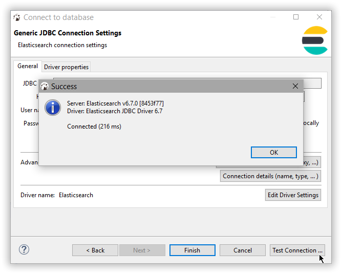

---
mapped_pages:
  - https://www.elastic.co/guide/en/elasticsearch/reference/current/sql-client-apps-dbeaver.html
applies_to:
  stack: ga
  serverless: ga
products:
  - id: elasticsearch
---

# DBeaver [sql-client-apps-dbeaver]

You can use the {{es}} JDBC driver to access {{es}} data from DBeaver.

::::{important}
Elastic does not endorse, promote or provide support for this application; for native {{es}} integration in this product, reach out to its vendor.
::::

## Prerequisites [_prerequisites_2]

* [DBeaver](https://dbeaver.io/) version 6.0.0 or higher
* Elasticsearch SQL [JDBC driver](sql-jdbc.md)

## New Connection [_new_connection]

Create a new connection either through the menu **File** > **New** > **Database Connection** menu or directly through the **Database Connection** panel.

## Select {{es}} type [_select_es_type]

Select the {{es}} type from the available connection types:

## Specify the {{es}} cluster information [_specify_the_es_cluster_information]

Configure the {{es}} SQL connection appropriately:

## Verify the driver version [_verify_the_driver_version]

Make sure the correct JDBC driver version is used by using the **Edit Driver Settings** button:

DBeaver is aware of the {{es}} JDBC maven repository so simply **Download/Update** the artifact or add a new one. As an alternative one can add a local file instead if the {{es}} Maven repository is not an option.

When changing the driver, make sure to click on the **Find Class** button at the bottom - the Driver class should be picked out automatically however this provides a sanity check that the driver jar is properly found and it is not corrupt.

## Test connectivity [_test_connectivity]

Once the driver version and the settings are in place, use **Test Connection** to check that everything works. If things are okay, one should get a confirmation window with the version of the driver and that of {{es}} SQL:

Click **Finish** and the new {{es}} connection appears in the **Database Connection** panel.

DBeaver is now configured to talk to {{es}}.

## Connect to {{es}} [_connect_to_es]

Simply click on the {{es}} connection and start querying and exploring {{es}}:

