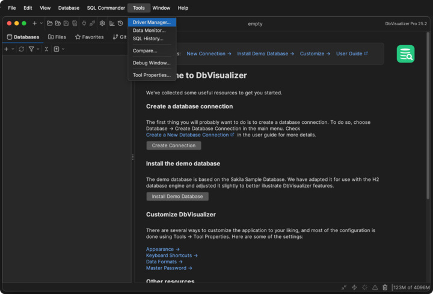
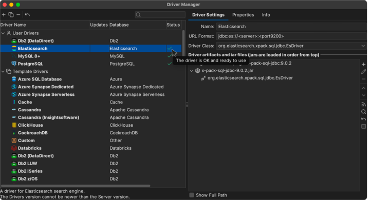
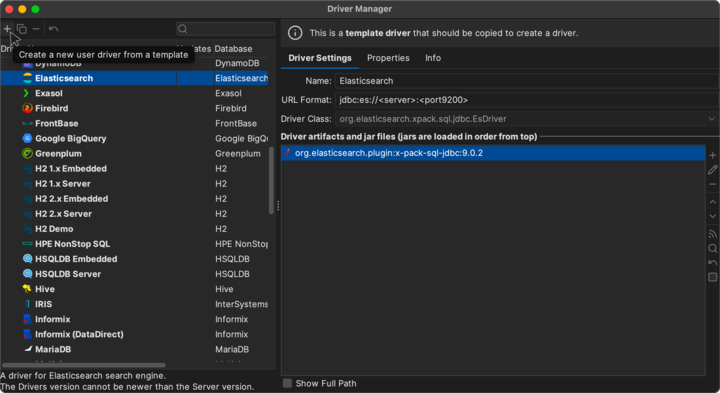
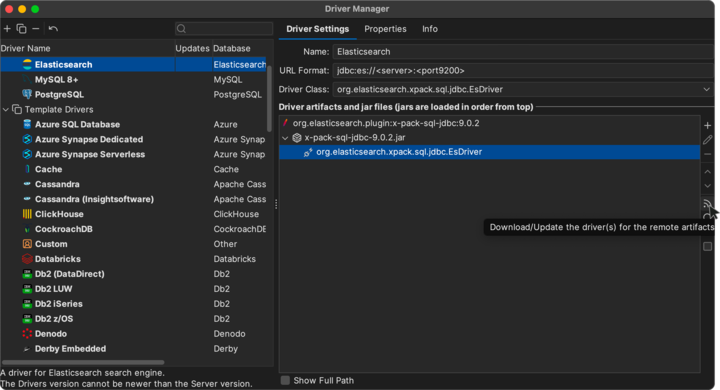
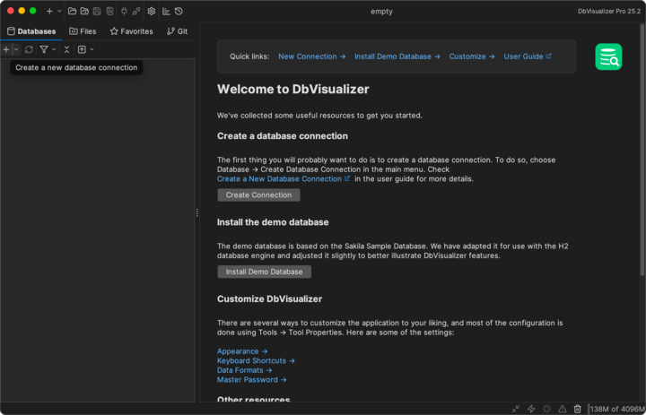
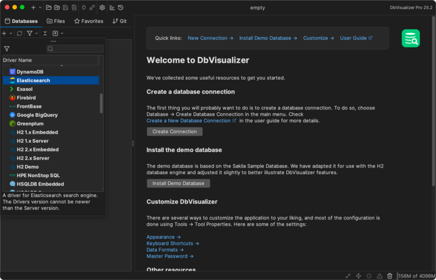
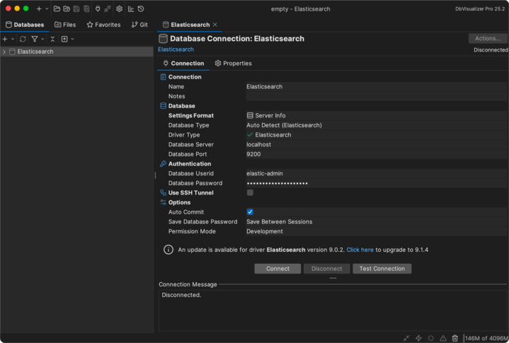
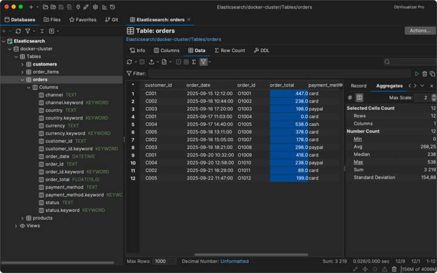

---
mapped_pages:
  - https://www.elastic.co/guide/en/elasticsearch/reference/current/sql-client-apps-dbvis.html
applies_to:
  stack: ga
  serverless: ga
products:
  - id: elasticsearch
---

# DbVisualizer [sql-client-apps-dbvis]

You can use the {{es}} JDBC driver to access {{es}} data from DbVisualizer.

::::{important}
Elastic does not endorse, promote or provide support for this application.
::::

## Prerequisites [_prerequisites_3]

* [DbVisualizer](https://www.dbvis.com/) 13.0 or higher
* Elasticsearch SQL [JDBC driver](sql-jdbc.md)

  Note
  :   Pre 13.0 versions of DbVisualizer can still connect to {{es}} by having the [JDBC driver](sql-jdbc.md) set up from the generic **Custom** template.

## Setup the {{es}} JDBC driver [_setup_the_es_jdbc_driver]

Setup the {{es}} JDBC driver through **Tools** > **Driver Manager**:

Select **Elasticsearch** driver template from the left sidebar to create a new user driver:

Download the driver locally:

and check its availability status:

## Create a new connection [_create_a_new_connection]

Once the {{es}} driver is in place, create a new connection:

by double-clicking the {{es}} entry in the list of available drivers:

Enter the connection details, then press **Connect** and the driver version (as that of the cluster) should show up under **Connection Message**.

## Execute SQL queries [_execute_sql_queries]

The setup is done. DbVisualizer can be used to run queries against {{es}} and explore its content:

