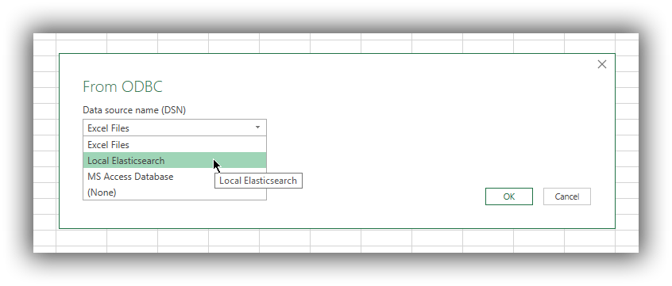

---
mapped_pages:
  - https://www.elastic.co/guide/en/elasticsearch/reference/current/sql-client-apps-excel.html
applies_to:
  stack: ga
  serverless: ga
products:
  - id: elasticsearch
---

# Microsoft Excel [sql-client-apps-excel]

You can use the {{es}} ODBC driver to access {{es}} data from Microsoft Excel.

::::{important}
Elastic does not endorse, promote or provide support for this application; for native {{es}} integration in this product, reach out to its vendor.
::::

## Prerequisites [_prerequisites_4]

* [Microsoft Office](https://products.office.com/en/excel) 2016 or higher
* Elasticsearch SQL [ODBC driver](sql-odbc.md)
* A preconfigured User or System DSN (see [Configuration](sql-odbc-setup.md#dsn-configuration) section on how to configure a DSN).

## Load data into a spreadsheet [_load_data_into_a_spreadsheet]

First, you’ll need to choose ODBC as the source to load data from. To do so, click on the *Data* tab, then *New Query* button, in the drop-down menu expand *From Other Sources*, then choose *From ODBC*:

$$$apps_excel_fromodbc$$$

This will open a new window with a drop down menu populated with the DSNs that Excel found on the system. Choose a DSN configured to connect to your {{es}} instance and press the *OK* button:

$$$apps_excel_dsn$$$

This will lead to a new window, allowing the user to input the connection credentials.

A username might be required by Excel even if the {{es}} instance has no security enabled. Providing a bogus username with no password in this case will not hinder the connectivity. Note however that Excel will cache these credentials (so in case you do have security enabled, you won’t be prompted for the credentials a second time).

Fill in the username and the password and press *Connect*.

$$$apps_excel_cred$$$

Once connected, Excel will read {{es}}'s catalog and offer the user a choice of tables (indices) to load data from. Clicking on one of the tables will load a preview of the data within:

$$$apps_excel_picktable$$$

Now click the *Load* button, which will have Excel load all the data from the table into a spreadsheet:

$$$apps_excel_loaded$$$

