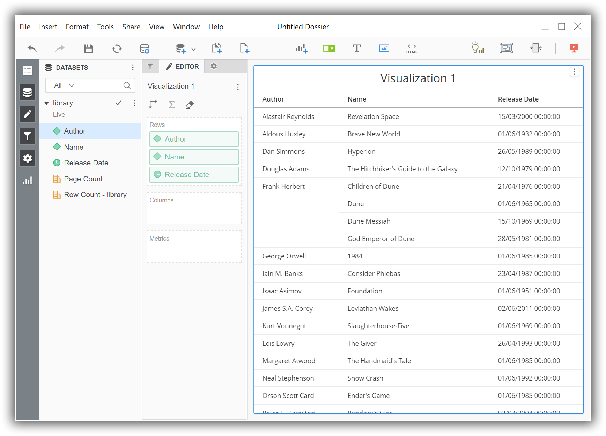

---
mapped_pages:
  - https://www.elastic.co/guide/en/elasticsearch/reference/current/sql-client-apps-microstrat.html
applies_to:
  stack: ga
  serverless: ga
products:
  - id: elasticsearch
---

# MicroStrategy Desktop [sql-client-apps-microstrat]

You can use the {{es}} ODBC driver to access {{es}} data from MicroStrategy Desktop.

::::{important}
Elastic does not endorse, promote or provide support for this application; for native {{es}} integration in this product, reach out to its vendor.
::::

## Prerequisites [_prerequisites_7]

* [MicroStrategy Desktop](https://www.microstrategy.com/us/get-started/desktop) 11 or higher
* {{es}} SQL [ODBC driver](sql-odbc.md)
* A preconfigured User or System DSN (see [Configuration](sql-odbc-setup.md#dsn-configuration) section on how to configure a DSN).

## Data loading [_data_loading_2]

To use the {{es}} SQL ODBC Driver to load data into MicroStrategy Desktop perform the following steps in sequence.

1. Create a New Dossier

   Once the application is launched, you’ll first need to create a *New Dossier*:

   $$$apps_microstrat_newdossier$$$
   

2. New Data

   To import into the *New Dossier* just opened, press on the *New Data* button in the *DATASETS* column:

   $$$apps_microstrat_newdata$$$
   

3. Access data from Tables

   This opens a new window that allows to choose the source to load data from. Click on the *Databases* icon:

   $$$apps_microstrat_databases$$$
   

4. New Data Source

   In the newly opened *Import from Table - Select* window, click on the **+** button to the right of *DATA SOURCES* item:

   $$$apps_microstrat_newds$$$
   

5. Data Source

   In the *Data Source* window, tick the radio button for *DSN Data Sources*. In the *DSN* drop-down box, choose the name of the DSN that you have previously configured. For the *Version*, chose *Generic DBMS*.

   Input a user name and password in the provided fields. Note that the application requires them irrespective of the fact that they might already be part of the previously configured DSN and the new input will take precedence over those.

   Finally, give a name to the application-specific data source you’re just configuring:

   $$$apps_microstrat_dsn$$$
   

6. Select Import Options

   Choosing an import methodology follows. You can pick any of the options; we’ll exemplify the *Select Tables* option:

   $$$apps_microstrat_tables$$$
   

7. Import from Table - Select

   The data source you’ve named two steps before is now listed in the *DATA SOURCES* column. Clicking on its name triggers the application to query the {{es}} instance configured in the DSN and list the tables available within:

   $$$apps_microstrat_loadtable$$$
   

8. Data Access Mode

   Choose a table to load data from and press the *Finish* button. When doing so, the application offers to choose a loading methodology. You can choose whichever, we’ll exemplify the *Connect Live* way:

   $$$apps_microstrat_live$$$
   

9. Visualize the data

   From the *DATASETS* column you can choose what table columns (or index fields) to visualize:

   $$$apps_microstrat_visualize$$$
   

