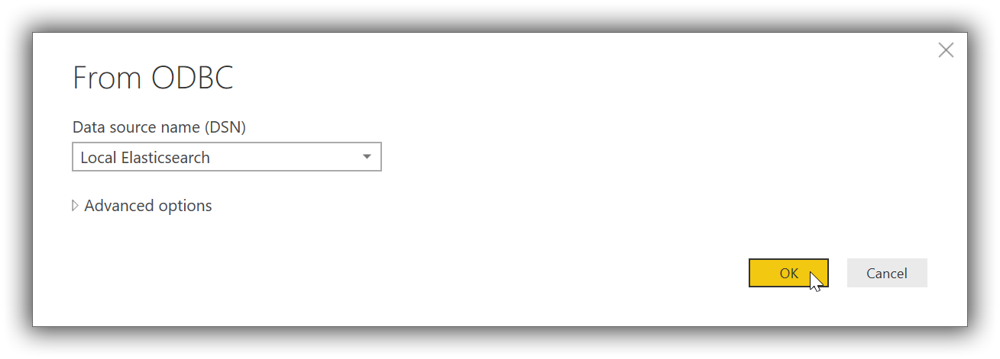
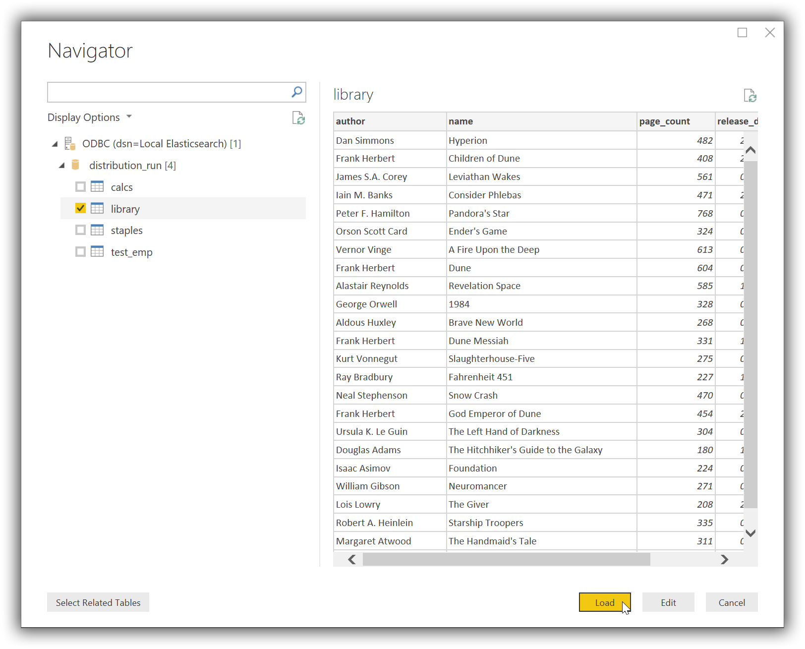

---
mapped_pages:
  - https://www.elastic.co/guide/en/elasticsearch/reference/current/sql-client-apps-powerbi.html
applies_to:
  stack: ga
  serverless: ga
products:
  - id: elasticsearch
---

# Microsoft Power BI Desktop [sql-client-apps-powerbi]

You can use the {{es}} ODBC driver to access {{es}} data from Microsoft Power BI Desktop.

::::{important}
Elastic does not endorse, promote or provide support for this application; for native {{es}} integration in this product, reach out to its vendor.
::::

## Prerequisites [_prerequisites_5]

* [Microsoft Power BI Desktop](https://powerbi.microsoft.com/en-us/desktop/) 2.63 or higher
* {{es}} SQL [ODBC driver](sql-odbc.md)
* A preconfigured User or System DSN (see [Configuration](sql-odbc-setup.md#dsn-configuration) section on how to configure a DSN).

## Data loading [_data_loading]

First, you’ll need to choose ODBC as the source to load data from. Once launched, click on the *Get Data* button (under *Home* tab), then on the *More…* button at the bottom of the list:

$$$apps_pbi_fromodbc1$$$

In the new opened window scroll at the bottom of the *All* list and select the *ODBC* entry, then click on the *Connect* button:

$$$apps_pbi_fromodbc2$$$

This will replace current window with a new *From ODBC* one, where you’ll have to select a previously configured DSN:

$$$apps_pbi_dsn$$$

Once connected Power BI will read {{es}}'s catalog and offer the user a choice of tables (indices) to load data from. Clicking on one of the tables will load a preview of the data within:

$$$apps_pbi_picktable$$$

Now tick the chosen table and click on the *Load* button. Power BI will now load and analyze the data, populating a list with the available columns. These can now be used to build the desired visualisation:

$$$apps_pbi_loaded$$$

