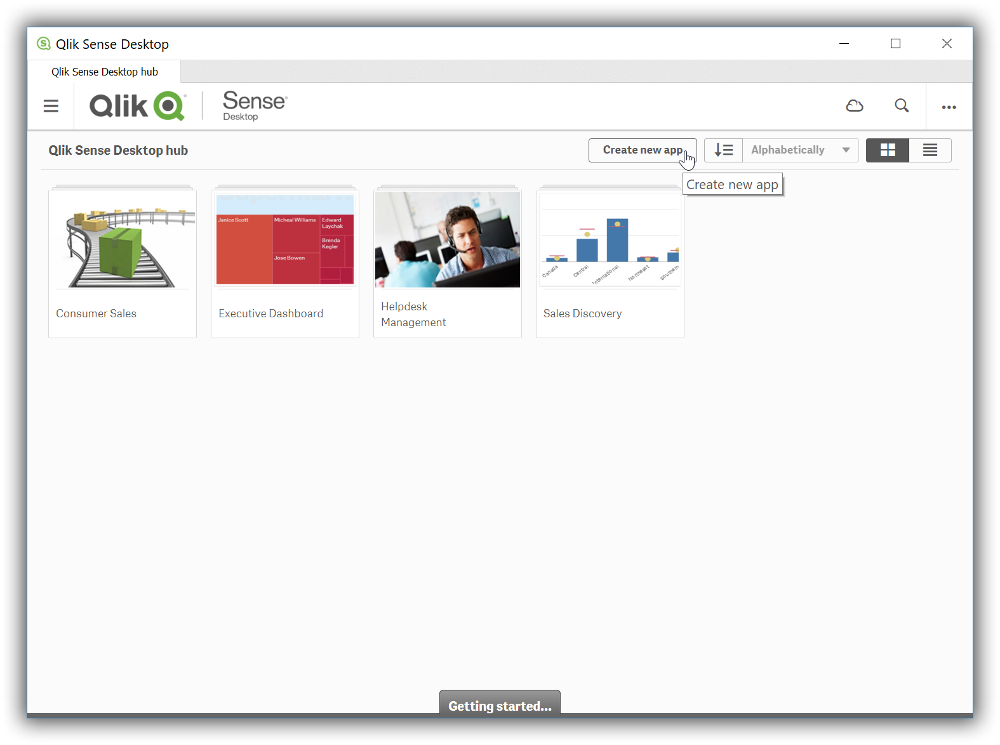
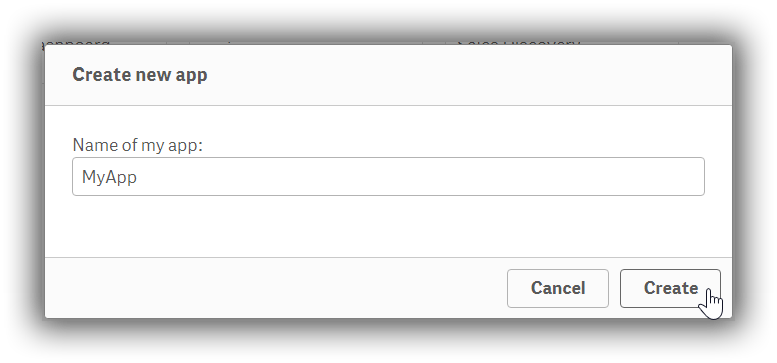
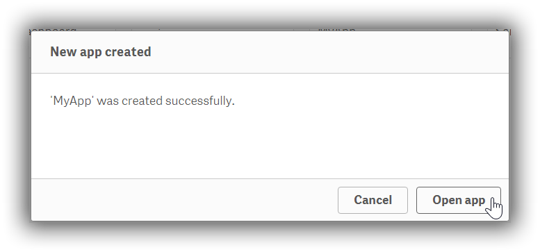
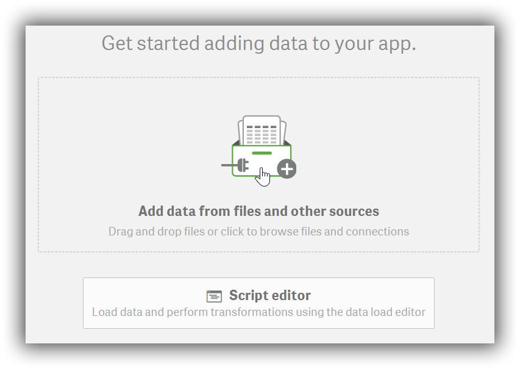
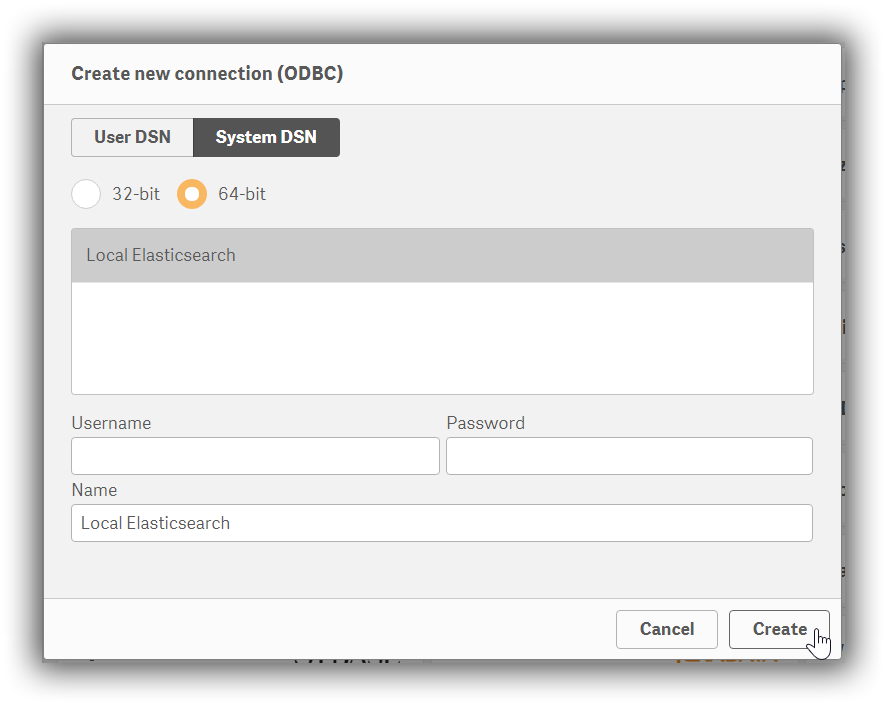
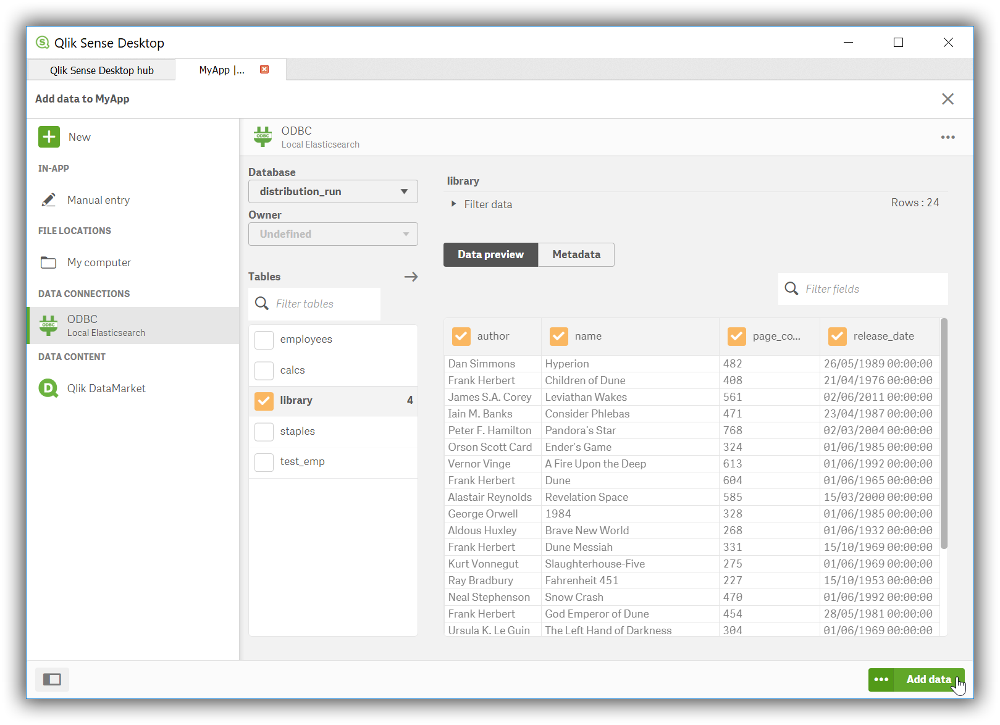

---
mapped_pages:
  - https://www.elastic.co/guide/en/elasticsearch/reference/current/sql-client-apps-qlik.html
applies_to:
  stack: ga
  serverless: ga
products:
  - id: elasticsearch
---

# Qlik Sense Desktop [sql-client-apps-qlik]

You can use the {{es}} ODBC driver to access {{es}} data from Qlik Sense Desktop.

::::{important}
Elastic does not endorse, promote or provide support for this application; for native {{es}} integration in this product, reach out to its vendor.
::::

## Prerequisites [_prerequisites_8]

* [Qlik Sense Desktop](https://community.qlik.com/t5/Download-Qlik-Products/tkb-p/Downloads) November 2018 or higher. You must have a Qlik account to download it.
* {{es}} SQL [ODBC driver](sql-odbc.md)
* A preconfigured User or System DSN (see [Configuration](sql-odbc-setup.md#dsn-configuration) section on how to configure a DSN).

## Data loading [_data_loading_3]

To use the {{es}} SQL ODBC Driver to load data into Qlik Sense Desktop perform the following steps in sequence.

1. Create new app

   Once the application is launched, you’ll first need to click on the *Create new app* button:

   $$$apps_qlik_newapp$$$
   

2. Name app

   …then give it a name,

   $$$apps_qlik_create$$$
   

3. Open app

   …and then open it:

   $$$apps_qlik_open$$$
   

4. Add data to your app

   Start configuring the source to load data from in the newly created app:

   $$$apps_qlik_adddata$$$
   

5. Load from ODBC

   You’ll be given a choice of sources to select. Click on the *ODBC* icon:

   $$$apps_qlik_odbc$$$
   

6. Choose DSN

   In the *Create new connection (ODBC)* dialog, click on the DSN name that you have previously configured for your {{es}} instance:

   $$$apps_qlik_dsn$$$
   

   Provide a username and password in the respective fields, if authentication is enabled on your instance and if these are not already part of the DSN. Press the *Create* button.

7. Select source table

   The application will now connect to the {{es}} instance and query the catalog information, presenting you with a list of tables that you can load data from:

   $$$apps_qlik_selecttable$$$
   

8. Visualize the data

   Press on the *Add data* button and customize your data visualization:

   $$$apps_qlik_visualize$$$
   

