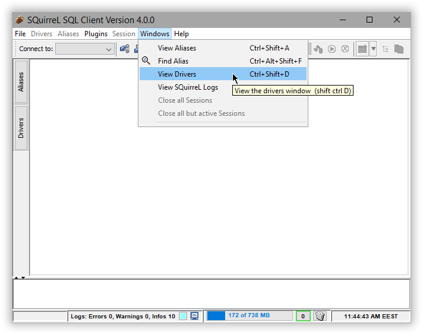
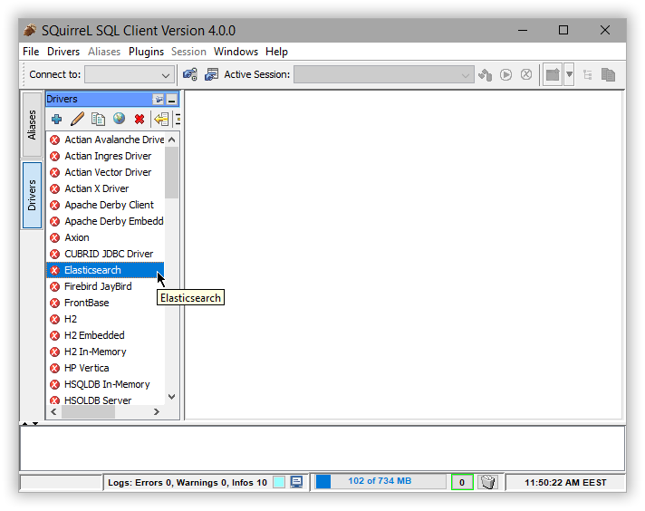
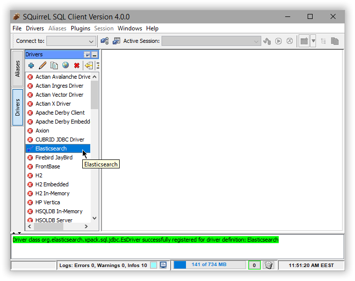
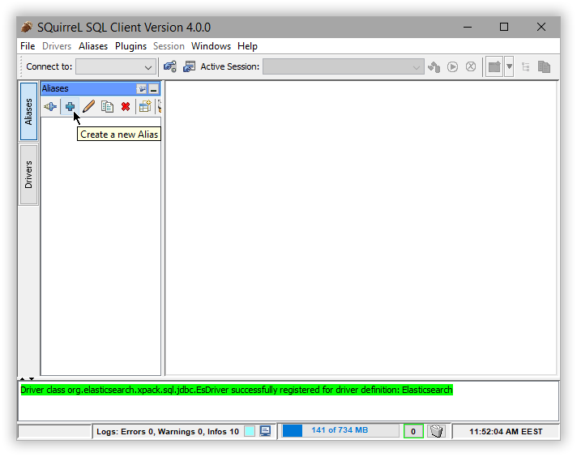
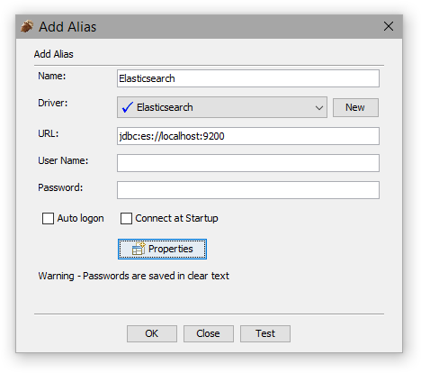
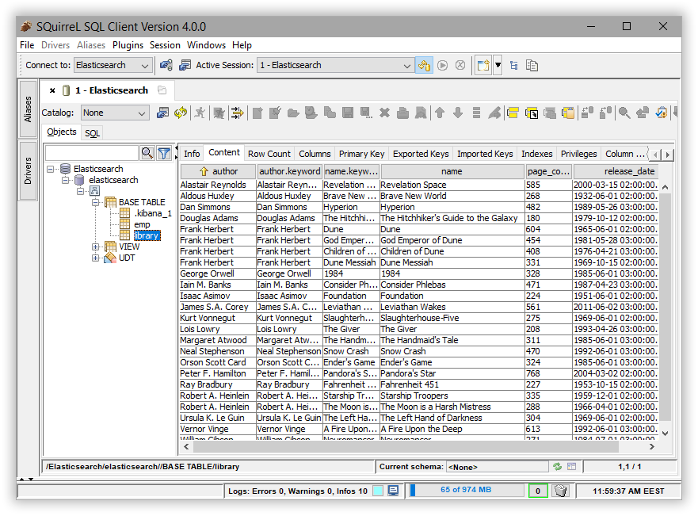

---
mapped_pages:
  - https://www.elastic.co/guide/en/elasticsearch/reference/current/sql-client-apps-squirrel.html
applies_to:
  stack: ga
  serverless: ga
products:
  - id: elasticsearch
---

# SQuirreL SQL [sql-client-apps-squirrel]

You can use the {{es}} JDBC driver to access {{es}} data from SQuirreL SQL.

::::{important}
Elastic does not endorse, promote or provide support for this application; for native {{es}} integration in this product, reach out to its vendor.
::::

## Prerequisites [_prerequisites_9]

* [SQuirreL SQL](http://squirrel-sql.sourceforge.net/) version 4.0.0 or higher
* {{es}} SQL [JDBC driver](sql-jdbc.md)

## Add {{es}} JDBC Driver [_add_es_jdbc_driver]

To add the {{es}} JDBC driver, use **Windows** > **View Drivers** menu (or Ctrl+Shift+D shortcut):

Select **Elasticsearch** profile from the `Drivers` panel on the left-hand side (if it is missing check the SQuirreL SQL version or add a new entry to the list through the + button in the upper left corner):

Select the **Extra Class Path** tab and **Add** the JDBC jar. Name the connection and **List Drivers** to have `Class Name` populated if it is not already filled-in :

The driver should now appear in the list with a blue check mark next to its name:

## Add an alias for {{es}} [_add_an_alias_for_es]

Add a new connection or in SQuirreL terminology an *alias* using the new driver. To do so, select the **Aliases** panel on the left and click the `+` sign:

Name the new alias and select the `Elasticsearch` driver previously added:

The setup is completed. Double check it by clicking on **Test Connection**.

## Execute SQL queries [_execute_sql_queries_2]

The connection should open automatically (if it has been created before simply click on **Connect** in the **Alias** panel). SQuirreL SQL can now issue SQL commands to {{es}}:

