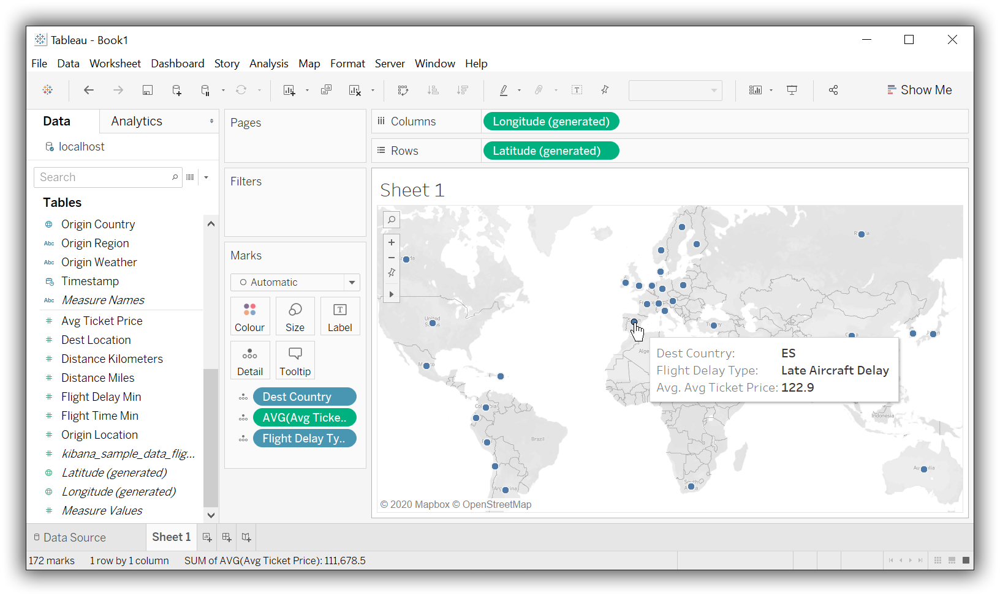

---
mapped_pages:
  - https://www.elastic.co/guide/en/elasticsearch/reference/current/sql-client-apps-tableau-desktop.html
applies_to:
  stack: ga
  serverless: ga
products:
  - id: elasticsearch
---

# Tableau Desktop [sql-client-apps-tableau-desktop]

Use the {{es}} JDBC driver and dedicated {{es}} Tableau Connector to access {{es}} data from Tableau Desktop.

::::{important}
Elastic does not endorse, promote or provide support for this application; for native {{es}} integration in this product, reach out to its vendor.
::::

## Prerequisites [sql-client-apps-tableau-desktop-prereqs]

* [Tableau Desktop](https://www.tableau.com/products/desktop) 2019.4 or later
* {{es}} SQL [JDBC driver](sql-jdbc.md)
* [{{es}} Connector for Tableau](https://www.elastic.co/downloads/tableau-connector)

## Load data [sql-client-apps-tableau-desktop-load-data]

First, move or download the JDBC driver to the Tableau Desktop drivers directory:

* Windows: `C:\Program Files\Tableau\Drivers`
* Mac: `/Users/[user]/Library/Tableau/Drivers`

Move the {{es}} Connector for Tableau to the Tableau Desktop connectors directory:

* Windows: `C:\Users\[Windows User]\Documents\My Tableau Repository\Connectors`
* Mac: `/Users/[user]/Documents/My Tableau Repository/Connectors`

Launch Tableau Desktop. In the menu, click **More…** and select **{{es}} by Elastic** as the data source.

$$$apps_tableau_desktop_from_connector$$$

In the **New connection** modal, enter the information for your {{es}} instance, and click **Sign In**.

$$$apps_tableau_connect$$$

In the main window, select your {{es}} instance as the **Database**. Then select a table to load.

$$$apps_tableau_prepare$$$

Finally, generate a report.

$$$apps_tableau_report$$$

