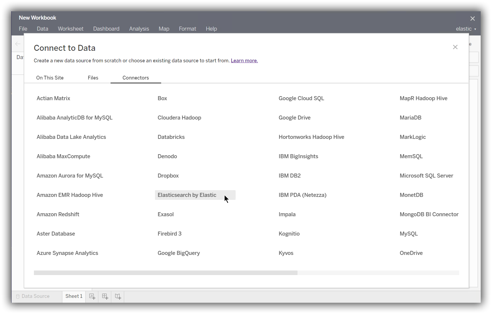
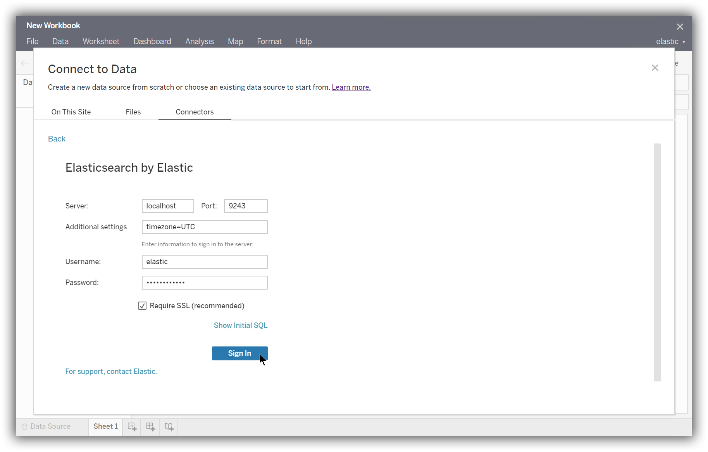
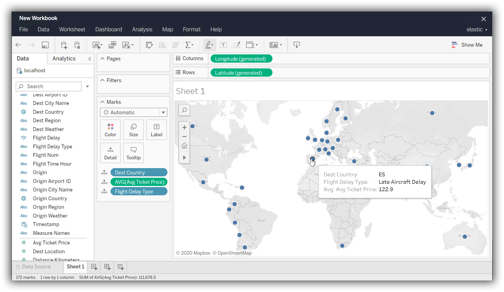

---
mapped_pages:
  - https://www.elastic.co/guide/en/elasticsearch/reference/current/sql-client-apps-tableau-server.html
applies_to:
  stack: ga
  serverless: ga
products:
  - id: elasticsearch
---

# Tableau Server [sql-client-apps-tableau-server]

Use the {{es}} JDBC driver and dedicated {{es}} Tableau Connector to access {{es}} data from Tableau Server.

::::{important}
Elastic does not endorse, promote or provide support for this application; for native {{es}} integration in this product, reach out to its vendor.
::::

## Prerequisites [sql-client-apps-tableau-server-prereqs]

* [Tableau Server](https://www.tableau.com/products/server) 2019.4 or later
* {{es}} SQL [JDBC driver](sql-jdbc.md)
* [{{es}} Connector for Tableau](https://www.elastic.co/downloads/tableau-connector)

## Load data [sql-client-apps-tableau-server-load-data]

First, move or download the JDBC driver to the Tableau Server drivers directory:

* Windows: `C:\Program Files\Tableau\Drivers`
* Mac: `/Users/[user]/Library/Tableau/Drivers`

Move the {{es}} Connector for Tableau to the Tableau Server connectors directory. To find the location of this directory, refer to Tableau Server documentation or use the TSM command line interface.

Restart Tableau Server.

To load data into a workbook, add a **New Data Source** from the **Data** menu or using the icon. In the **Connectors** tab of the **Connect to Data** modal, select **Elasticsearch by Elastic**.

$$$apps_tableau_server_from_connector$$$

Enter the information for your {{es}} instance, and click **Sign In**.

$$$apps_tableau_server_connect$$$

In the main window, select your {{es}} instance as the **Database**. Then select a table to load.

$$$apps_tableau_server_prepare$$$

Finally, generate a report.

$$$apps_tableau_server_report$$$

