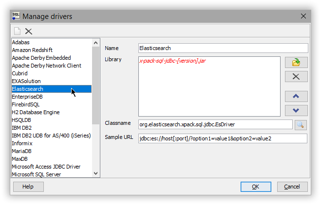

---
mapped_pages:
  - https://www.elastic.co/guide/en/elasticsearch/reference/current/sql-client-apps-workbench.html
applies_to:
  stack: ga
  serverless: ga
products:
  - id: elasticsearch
---

# SQL Workbench/J [sql-client-apps-workbench]

You can use the {{es}} JDBC driver to access {{es}} data from SQL Workbench/J.

::::{important}
Elastic does not endorse, promote or provide support for this application; for native {{es}} integration in this product, reach out to its vendor.
::::

## Prerequisites [_prerequisites_10]

* [SQL Workbench/J](https://www.sql-workbench.eu/) build 125 or higher
* {{es}} SQL [JDBC driver](sql-jdbc.md)

## Add {{es}} JDBC driver [_add_es_jdbc_driver_2]

Add the {{es}} JDBC driver to SQL Workbench/J through **Manage Drivers** either from the main windows in the **File** menu or from the **Connect** window:

Select **Elasticsearch** profile from the left-hand side (if it is missing check the SQL Workbench/J version or add a new entry to the list through the blank page button in the upper left corner):

Add the JDBC jar (if the driver name hasn’t been picked up already,  click on the magnifier button):

## Create a new connection profile [_create_a_new_connection_profile]

With the driver configured, create a new connection profile through **File** > **Connect Window** (or Alt+C shortcut):

Select the previously configured driver and set the URL of your cluster using the JDBC syntax. Verify the connection through the **Test** button - a confirmation window should appear that everything is properly configured.

The setup is complete.

## Execute SQL queries [_execute_sql_queries_3]

SQL Workbench/J is ready to talk to {{es}} through SQL: click on the profile created to execute statements or explore the data:

