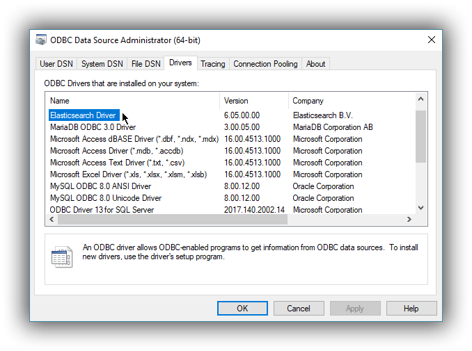
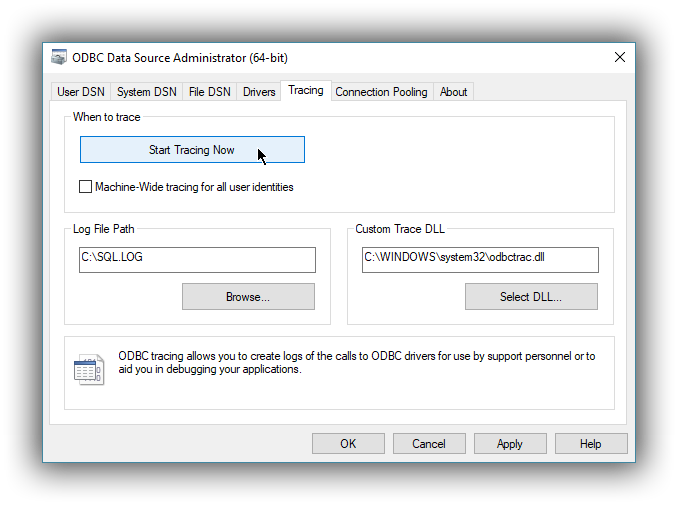
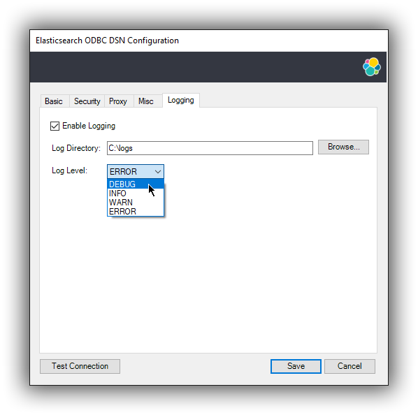

---
mapped_pages:
  - https://www.elastic.co/guide/en/elasticsearch/reference/current/sql-odbc-setup.html
applies_to:
  stack: ga
  serverless: ga
products:
  - id: elasticsearch
---

# Configuration [sql-odbc-setup]

Once the driver has been installed, in order for an application to be able to connect to {{es}} through ODBC, a set of configuration parameters must be provided to the driver. Depending on the application, there are generally three ways of providing these parameters:

* through a connection string;
* using a User DSN or System DSN;
* through a File DSN.

DSN (*data source name*) is a generic name given to the set of parameters an ODBC driver needs to connect to a database.

We will refer to these parameters as *connection parameters* or *DSN* (despite some of these parameters configuring some other aspects of a driver’s functions; e.g. logging, buffer sizes…).

Using a DSN is the most widely used, simplest and safest way of performing the driver configuration. Constructing a connection string, on the other hand, is the most crude way and consequently the least common method.

We will focus on DSN usage only.

## 1. Launching ODBC Data Source Administrator [data-source-administrator]

For DSN management, ODBC provides the *ODBC Data Source Administrator* application, readily installed on all recent desktop Windows operating systems.

* The 32-bit version of the Odbcad32.exe file is located in the `%systemdrive%\Windows\SysWoW64` folder.
* The 64-bit version of the Odbcad32.exe file is located in the `%systemdrive%\Windows\System32` folder.

To launch it, open the search menu - *Win + S* - and type "ODBC Data Sources (64-bit)" or "ODBC Data Sources (32-bit)" and press *Enter*:

$$$launch_administrator$$$

Once launched, you can verify that the driver was installed correctly by clicking on the *Drivers* tab of the ODBC Data Source Administrator and checking that *Elasticsearch Driver* is present in the list of installed drivers.

You should also see the version number of the installed driver.

$$$administrator_drivers$$$

## 2. Configure a DSN [dsn-configuration]

The next step is to configure a DSN. You can choose between the following options mapped on the first three tabs of the Administrator application:

* User DSN

  The connections configured under this tab are only available to the currently logged in user. Each of these DSNs are referred to by a chosen arbitrary name (typically a host or cluster name).

  The actual set of parameters making up the DSN is stored through the driver in the system registry. Thus, a user will later only need to provide an application with the DSN name in order to connect to the configured {{es}} instance.

* System DSN

  Similar to a User DSN, except that the connections configured under this tab will be available to all the users configured on the system.

* File DSN

  This tab contains functionality that will allow to have one set of connection parameters written into a file, rather then the Registry.

  Such a file can be then shared among multiple systems and the user will need to specify the path to it, in order to have the application connect to the configured {{es}} instance.

The configuration steps are similar for all the above points. Following is an example of configuring a System DSN.

#### 2.1 Launch Elasticsearch SQL ODBC Driver DSN Editor [_2_1_launch_elasticsearch_sql_odbc_driver_dsn_editor]

Click on the *System DSN* tab, then on the *Add…* button:

$$$system_add$$$

A new window will open, listing all available installed drivers. Click on *{{es}} Driver*, to highlight it, then on the *Finish* button:

$$$launch_editor$$$

This action closes the previously opened second window and open a new one instead, Elasticsearch SQL ODBC Driver’s DSN Editor:

$$$dsn_editor$$$

This new window has three tabs, each responsible for a set of configuration parameters, as follows.

#### 2.2 Connection parameters [connection_parameters]

This tab allows configuration for the following items:

* Name
  This is the name the DSN will be referred by.

  ::::{note}
  The characters available for this field are limited to the set permitted for a Registry key.
  ::::

    Example: *localhost*

* Description

  This field allows a arbitrary text; generally used for short notes about the configured connection.

  Example: *Clear-text connection to the local [::1]:9200.*

* Cloud ID

  The *Cloud ID* is a string that simplifies the configuration when connecting to {{ecloud}}. It encodes the connection parameters to that cluster. You can obtain it from from your deployment's details in the {{ecloud}} Console.

  ::::{note}
  When this field is provisioned, the *Hostname*, *Port* and the security settings are provisioned as well and their respective inputs disabled.
  ::::

* Hostname

  This field requires an IP address or a resolvable DNS name of the {{es}} instance that the driver will connect to.

  Example: *::1*

* Port

  The port on which the {{es}} listens on.

  ::::{note}
  If left empty, the default **9200** port number will be used.
  ::::

* Username, Password

  If security is enabled, these fields will need to contain the credentials of the access user.

At a minimum, the *Name* and *Hostname* fields must be provisioned, before the DSN can be saved.

::::{warning}
Connection encryption is enabled by default. This will need to be changed if connecting to an {{es}} node with no encryption.
::::

#### 2.3 Cryptography parameters [_2_3_cryptography_parameters]

One of the following SSL options can be chosen:

* Disabled. All communications unencrypted.

  The communication between the driver and the {{es}} instance is performed over a clear-text connection.

  ::::{warning}
  This setting can expose the access credentials to a 3rd party intercepting the network traffic and is not recommended.
  ::::

* Enabled. Certificate not validated.

  The connection encryption is enabled, but the certificate of the server is not validated.

  This is currently the default setting.

  ::::{note}
  This setting allows a 3rd party to act with ease as a man-in-the-middle and thus intercept all communications.
  ::::

* Enabled. Certificate is validated; hostname not validated.

  The connection encryption is enabled and the driver verifies that server’s certificate is valid, but it does **not** verify if the certificate is running on the server it was meant for.

  ::::{note}
  This setting allows a 3rd party that had access to server’s certificate to act as a man-in-the-middle and thus intercept all the communications.
  ::::

* Enabled. Certificate is validated; hostname validated.

  The connection encryption is enabled and the driver verifies that both the certificate is valid, as well as that it is being deployed on the server that the certificate was meant for.

* Enabled. Certificate identity chain validated.

  This setting is equivalent to the previous one, with one additional check against certificate’s revocation. This offers the strongest security option and is the recommended setting for production deployments.

* Certificate File

  In case the server uses a certificate that is not part of the PKI, for example using a self-signed certificate, you can configure the path to a X.509 certificate file that will be used by the driver to validate server’s offered certificate.

  The driver will only read the contents of the file just before a connection is attempted. See [2.7 Testing the connection](#connection_testing) section further on how to check the validity of the provided parameters.

  ::::{note}
  The certificate file can not be bundled or password protected since the driver will not prompt for a password.
  ::::

If using the file browser to locate the certificate - by pressing the *Browse…* button - only files with *.pem* and *.der* extensions will be considered by default. Choose *All Files (*.*)* from the drop down, if your file ends with a different extension:

$$$dsn_editor_cert$$$

#### 2.4 Proxy parameters [_2_4_proxy_parameters]

If connecting to the {{es}} node needs to go through a proxy, the following parameters need to be configured:

* Type

  What kind of protocol to use when connecting to the proxy host. This also mandates how the {{es}} node you want to connect to over the proxy needs to be specified under [2.2 Connection parameters](#connection_parameters):

    * HTTP, SOCKS4A, SOCKS5H: either IP address or host name is accepted; the proxy will resolve the DNS name;
    * SOCKS4, SOCKS5: {{es}} node location needs to be provided as an IP address;

* Port

  The TCP port the proxy is listening for connections on.

* Username

  The user part of the credentials used to authenticate to the proxy.

* Password

  The password part of the credentials for the proxy.

$$$dsn_editor_proxy$$$

#### 2.5 Connection parameters [_2_5_connection_parameters]

The connection configuration can further be tweaked by the following parameters.

* Request timeout (s)

  The maximum time (in seconds) a request to the server can take. This can be overridden by a larger statement-level timeout setting. The value 0 means no timeout.

* Max page size (rows)

  The maximum number of rows that Elasticsearch SQL server should send the driver for one page. This corresponds to the SQL search API’s [`fetch_size`](https://www.elastic.co/docs/api/doc/elasticsearch/operation/operation-sql-query) parameter. A `0` value indicates a server default.

* Max page length (MB)

  The maximum size (in megabytes) that an answer can grow to, before being rejected as too large by the driver. This is concerning the HTTP answer body of one page, not the cumulated data volume that a query might generate.

* Varchar limit

  The maximum width of the string columns. If this setting is greater than zero, the driver will advertise all the string type columns as having a maximum character length equal to this value and will truncate any longer string to it. The string types are textual fields (TEXT, KEYWORD etc.) and some specialized fields (IP, the GEOs etc.). Note that no interpretation of the value is performed before truncation, which can lead to invalid values if the limit is set too low. This is required for those applications that do not support column lengths as large as {{es}} fields can be.

* Floats format

  Controls how the floating point numbers will be printed, when these are converted to string by the driver. Possible values given to this parameter:

    * `scientific`: the exponential notation (ex.: 1.23E01);
    * `default`: the default notation (ex.: 12.3);
    * `auto`: the driver will choose one of the above depending on the value to be printed. Note that the number of decimals is dependent on the precision (or ODBC scale) of the value being printed and varies with the different floating point types supported by Elasticsearch SQL. This setting is not effective when the application fetches from the driver the values as numbers and then does the conversion subsequently itself.

* Data encoding

  This value controls which data format to encode the REST content in. Possible values are:

    * `CBOR`: use the Concise Binary Object Representation format. This is the preferred encoding, given its more compact format.
    * `JSON`: use the JavaScript Object Notation format. This format is more verbose, but easier to read, especially useful if troubleshooting.

* Data compression

  This setting controls if and when the REST content - encoded in one of the above formats -  is going to be compressed. The possible values are:

    * `on`: enables the compression;
    * `off`: disables the compression;
    * `auto`: enables the compression, except for the case when the data flows through a secure connection; since in this case the encryption layer employs its own data compression and there can be security implications when an additional compression is enabled, the setting should be kept to this value.

* Follow HTTP redirects

  Should the driver follow HTTP redirects of the requests to the server?

* Use local timezone

  This setting controls the timezone of:

    * the context in which the query will execute (especially relevant for functions dealing with timestamp components);
    * the timestamps received from / sent to the server.

      If disabled, the UTC timezone will apply; otherwise, the local machine’s set timezone.

* Auto-escape PVAs

  The pattern-value arguments make use of `_` and `%` as special characters to build pattern matching values. Some applications however use these chars as regular ones, which can lead to Elasticsearch SQL returning more data than the app intended. With the auto escaping, the driver will inspect the arguments and will escape these special characters if not already done by the application.

* Multi value field lenient

  This setting controls the behavior of the server in case a multi-value field is queried. In case this is set and the server encounters such a field, it will pick a value in the set - without any guarantees of what that will be, but typically the first in natural ascending order - and return it as the value for the column. If not set, the server will return an error. This corresponds to the SQL search API’s [`field_multi_value_leniency`](https://www.elastic.co/docs/api/doc/elasticsearch/operation/operation-sql-query) parameter.

* Include frozen indices

  If this parameter is `true`, the server will include the frozen indices in the query execution. This corresponds to Elasticsearch SQL’s request parameter `index_include_frozen`

* Early query execution

  If this configuration is set, the driver will execute a statement as soon as the application submits it for preparation - i.e. early - and is functionally equivalent to a direct execution. This will only happen if the query lacks parameters. Early execution is useful with those applications that inspect the result before actually executing the query. Elasticsearch SQL lacks a preparation API, so early execution is required for interoperability with these applications.

$$$dsn_editor_misc$$$

#### 2.6 Logging parameters [_2_6_logging_parameters]

For troubleshooting purposes, the Elasticsearch SQL ODBC Driver offers functionality to log the API calls that an application makes; this is enabled in the Administrator application:

$$$administrator_tracing$$$

However, this only logs the ODBC API calls made by the application into the *Driver Manager* and not those made by the *Driver Manager* into the driver itself. To enable logging of the calls that the driver receives, as well as internal driver processing events, you can enable driver’s logging on Editor’s *Logging* tab:

* Enable Logging?

  Ticking this will enable driver’s logging. A logging directory is also mandatory when this option is enabled (see the next option). However the specified logging directory will be saved in the DSN if provided, even if logging is disabled.

* Log Directory

  Here is to specify which directory to write the log files in.

  ::::{note}
  The driver will create **one log file per connection**, for those connections that generate logging messages.
  ::::

* Log Level

  Configure the verbosity of the logs.

  $$$administrator_logging$$$
  

  When authentication is enabled, the password will be redacted from the logs.

::::{note}
Debug-logging can quickly lead to the creation of many very large files and generate significant processing overhead. Only enable if instructed so and preferably only when fetching low volumes of data.
::::

#### 2.7 Testing the connection [connection_testing]

Once the *Hostname*, the *Port* (if different from implicit default) and the SSL options are configured, you can test if the provided parameters are correct by pressing the *Test Connection* button. This will instruct the driver to connect to the {{es}} instance and perform a simple SQL test query. (This will thus require a running {{es}} instance with the SQL plugin enabled.)

$$$dsn_editor_conntest$$$

::::{note}
When connection testing, all the configured parameters are taken into account, including the logging configuration. This will allow early detection of potential file/directory access rights conflicts.
::::

See [Alternative logging configuration](#alternative_logging) section further for an alternative way of configuring the logging.

## 3. DSN is available [available-dsn]

Once everything is in place, pressing the *Save* button will store the configuration into the chosen destination (Registry or file).

Before saving a DSN configuration the provided file/directory paths are verified to be valid on the current system. The DSN editor will however not verify in any way the validity or reachability of the configured *Hostname* : *Port*. See [2.7 Testing the connection](#connection_testing) for an exhaustive check.

If everything is correct, the name of the newly created DSN will be listed as available to use:

$$$system_added$$$

## Alternative logging configuration [alternative_logging]

Due to the specification of the ODBC API, the driver will receive the configured DSN parameters - including the logging ones - only once a connection API is invoked (such as *SQLConnect* or *SQLDriverConnect*). The *Driver Manager* will however always make a set of API calls into the driver before attempting to establish a connection. To capture those calls as well, one needs to pass logging configuration parameters in an alternative way. The Elasticsearch SQL ODBC Driver will use an environment variable for this purpose.

Configuring an environment variable is OS specific and not detailed in this guide. Whether the variable should be configured system-wide or user-specific depends on the way the ODBC-enabled application is being run and if logging should affect the current user only or not.

The definition of the environment variable needs to be done as follows:

* Name: *ESODBC_LOG_DIR*
* Value: `[path](?[level])`, where:

  [path] is the path to the directory where the log files will be written into;

  [level] is optional and can take one of the following values: *debug*, *info*, *warn*, *error*; if not provided, *debug* is assumed.

$$$env_var_logging$$$

::::{note}
When enabling the logging through the environment variable, the driver will create **one log file per process**.
::::

Both ways of configuring the logging can coexist and both can use the same destination logging directory. However, one logging message will only be logged once, the connection logging taking precedence over the environment variable logging.

