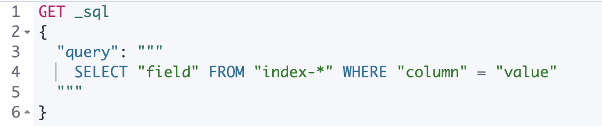

---
mapped_pages:
  - https://www.elastic.co/guide/en/elasticsearch/reference/current/sql-rest-overview.html
applies_to:
  stack: ga
  serverless: ga
products:
  - id: elasticsearch
---

# Overview [sql-rest-overview]

The [SQL search API](https://www.elastic.co/docs/api/doc/elasticsearch/operation/operation-sql-query) accepts SQL in a JSON document, executes it, and returns the results. For example:

```console
POST /_sql?format=txt
{
  "query": "SELECT * FROM library ORDER BY page_count DESC LIMIT 5"
}
```
% TEST[setup:library]

Which returns:

```text
     author      |        name        |  page_count   | release_date
-----------------+--------------------+---------------+------------------------
Peter F. Hamilton|Pandora's Star      |768            |2004-03-02T00:00:00.000Z
Vernor Vinge     |A Fire Upon the Deep|613            |1992-06-01T00:00:00.000Z
Frank Herbert    |Dune                |604            |1965-06-01T00:00:00.000Z
Alastair Reynolds|Revelation Space    |585            |2000-03-15T00:00:00.000Z
James S.A. Corey |Leviathan Wakes     |561            |2011-06-02T00:00:00.000Z
```
% TESTRESPONSE[s/\|/\\|/ s/\+/\\+/]
% TESTRESPONSE[non_json]

::::{admonition} Using Kibana Console
:class: tip

:name: sql-kibana-console

If you are using [Kibana Console](docs-content://explore-analyze/query-filter/tools/console.md) (which is highly recommended), take advantage of the triple quotes `"""` when creating the query. This not only automatically escapes double quotes (`"`) inside the query string but also support multi-line as shown below:



::::


